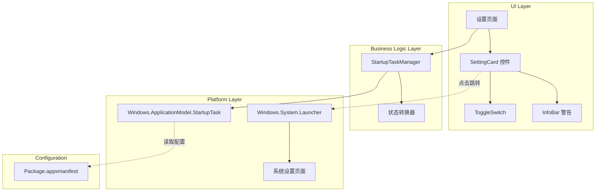
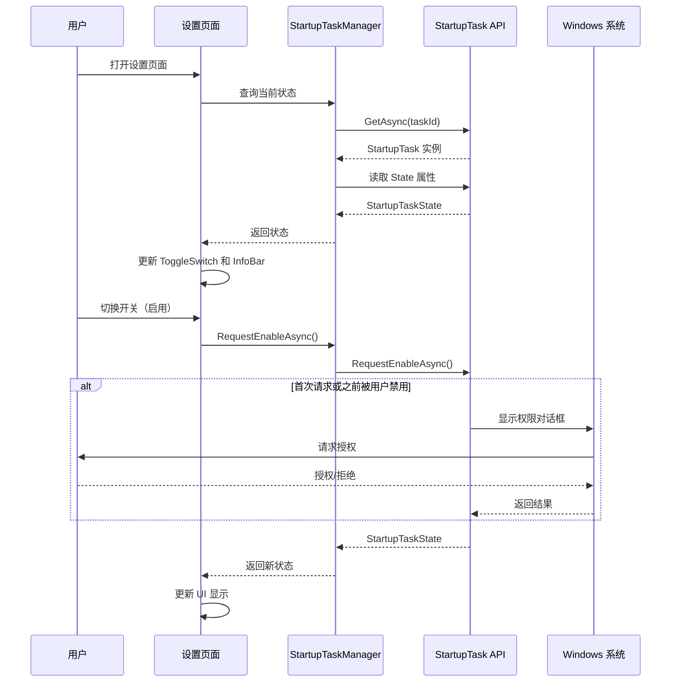
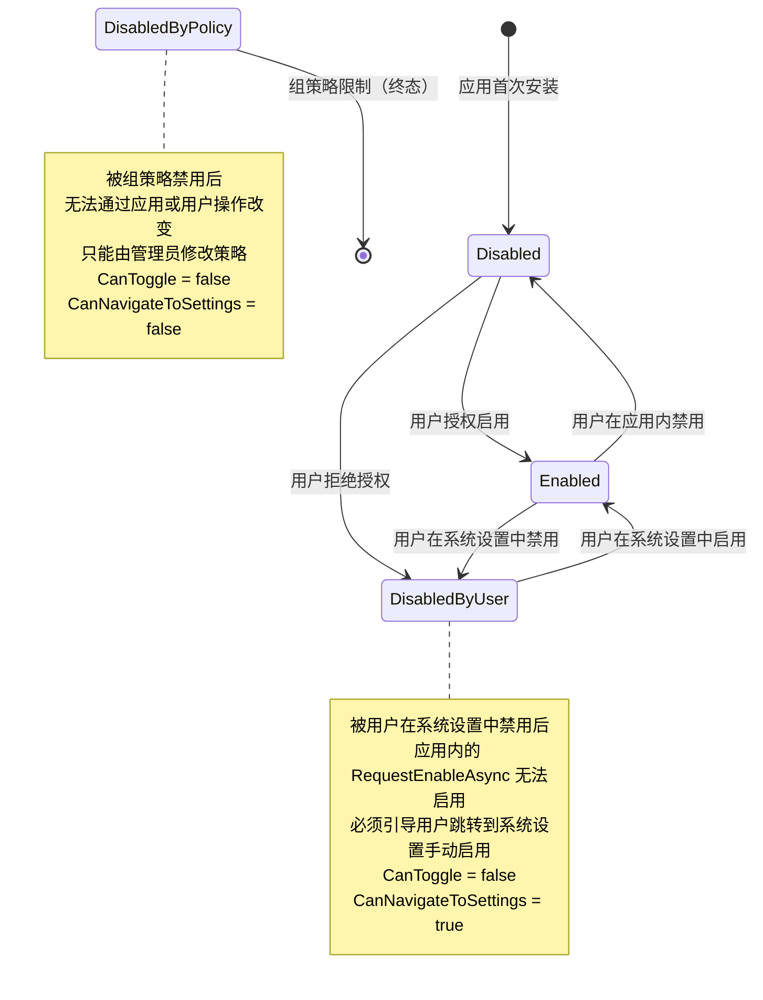
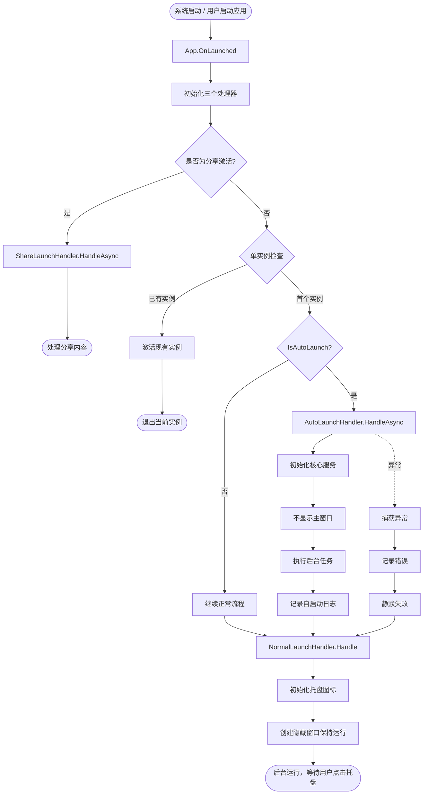

# 设计文档

## 概述

本设计文档描述了 Windows 商店应用（UWP/MSIX）开机自启动功能的技术实现方案。该功能允许用户配置应用在 Windows 系统启动时自动运行，提供便捷的用户体验同时遵守 Windows 平台的安全和隐私要求。

### 核心目标

- 提供符合 Windows 商店应用规范的开机自启动能力
- 实现用户友好的设置界面，清晰展示自启动状态
- 遵守系统安全策略和组策略限制
- 最小化对系统启动性能的影响

### 技术栈

- **平台**: Windows 10/11 (UWP/MSIX)
- **API**: Windows.ApplicationModel.StartupTask
- **UI 框架**: WinUI 3 / Windows App SDK
- **配置**: Package.appxmanifest

### 关键约束

- 必须在应用清单中声明 startupTask 受限能力
- 首次启用需要用户明确授权（系统对话框）
- 必须遵守组策略限制
- 自启动应用应快速完成初始化，避免阻塞系统启动

## 架构

### 高层架构

系统采用分层架构，将启动任务管理、UI 控制和应用生命周期管理分离：



### 组件职责

1. **StartupTaskManager**: 封装 Windows.ApplicationModel.StartupTask API，提供统一的启动任务管理接口
2. **设置页面 UI**: 展示自启动开关，处理用户交互，响应状态变化
3. **状态转换器**: 将 StartupTaskState 枚举转换为 UI 可用的状态信息
4. **Package.appxmanifest**: 声明启动任务和所需能力

### 数据流



## 组件和接口

### StartupTaskManager 类

负责管理应用的启动任务，封装 Windows.ApplicationModel.StartupTask API。

```csharp
public class StartupTaskManager
{
    private const string TaskId = "AppStartupTask";
    private readonly SemaphoreSlim _operationLock = new SemaphoreSlim(1, 1);
    
    /// <summary>
    /// 获取当前启动任务状态
    /// </summary>
    /// <returns>启动任务状态</returns>
    public async Task<StartupTaskState> GetStateAsync()
    {
        var task = await StartupTask.GetAsync(TaskId);
        return task.State;
    }
    
    /// <summary>
    /// 请求启用自启动功能
    /// 使用信号量避免并发调用，防止快速切换时的竞态条件
    /// </summary>
    /// <returns>操作后的状态</returns>
    public async Task<StartupTaskState> RequestEnableAsync()
    {
        // 尝试获取锁，如果已有操作在进行中，直接返回当前状态
        if (!await _operationLock.WaitAsync(0))
        {
            // 已有操作在进行中，返回当前状态避免并发调用
            return await GetStateAsync();
        }
        
        try
        {
            var task = await StartupTask.GetAsync(TaskId);
            var result = await task.RequestEnableAsync();
            return result;
        }
        finally
        {
            _operationLock.Release();
        }
    }
    
    /// <summary>
    /// 禁用自启动功能
    /// 使用信号量避免并发调用
    /// 注意：内部调用 StartupTask.Disable() 是同步方法，不会触发系统对话框
    /// </summary>
    /// <returns>禁用后的状态</returns>
    public async Task<StartupTaskState> DisableAsync()
    {
        // 尝试获取锁，如果已有操作在进行中，等待完成
        await _operationLock.WaitAsync();
        
        try
        {
            var task = await StartupTask.GetAsync(TaskId);
            task.Disable(); // 同步调用，立即生效
            return task.State; // 直接返回状态，避免额外的系统调用
        }
        finally
        {
            _operationLock.Release();
        }
    }
    
    /// <summary>
    /// 检查是否可以修改自启动状态
    /// DisabledByUser 状态下返回 false，因为必须在系统设置中启用
    /// DisabledByPolicy 状态下返回 false，因为被组策略限制
    /// </summary>
    /// <param name="currentState">当前状态</param>
    /// <returns>是否可修改</returns>
    public bool CanModifyState(StartupTaskState currentState)
    {
        return currentState != StartupTaskState.DisabledByUser &&
               currentState != StartupTaskState.DisabledByPolicy;
    }
}
```

### StartupTaskState 枚举

Windows.ApplicationModel.StartupTaskState 的可能值：

- **Disabled**: 已禁用，可以请求启用
- **Enabled**: 已启用
- **DisabledByUser**: 被用户在系统设置中禁用，需要用户在系统设置中重新启用
- **DisabledByPolicy**: 被组策略禁用，无法启用

### API 方法说明

- **StartupTask.GetAsync(taskId)**: 异步方法，获取启动任务实例
- **StartupTask.RequestEnableAsync()**: 异步方法，请求启用自启动，首次调用或被用户禁用后会显示系统权限对话框
- **StartupTask.Disable()**: 同步方法，立即禁用自启动，不会触发任何系统对话框
- **StartupTask.State**: 属性，获取当前状态


### UI 组件接口

#### SettingCard 配置

```xml
<SettingCard 
    Header="开机自启动"
    Description="允许应用在 Windows 启动时自动运行"
    IsClickEnabled="{x:Bind ViewModel.CanNavigateToSettings, Mode=OneWay}"
    Click="OnSettingCardClick">
    
    <SettingCard.HeaderIcon>
        <FontIcon Glyph="&#xE7E8;"/>
    </SettingCard.HeaderIcon>
    
    <ToggleSwitch 
        IsOn="{x:Bind ViewModel.IsStartupEnabled, Mode=TwoWay}"
        IsEnabled="{x:Bind ViewModel.CanToggle, Mode=OneWay}"
        Toggled="OnToggleSwitched"/>
</SettingCard>

<!-- 当状态为 DisabledByUser 时显示提示信息 -->
<InfoBar
    Severity="Informational"
    IsOpen="{x:Bind ViewModel.ShowUserDisabledInfo, Mode=OneWay}"
    Title="需要在系统设置中启用"
    Message="此应用的开机自启动已在系统设置中被禁用。请点击此卡片跳转到系统设置页面进行启用。"
    IsClosable="False"/>
```

#### InfoBar 配置

```xml
<InfoBar
    Severity="Warning"
    IsOpen="{x:Bind ViewModel.ShowPolicyWarning, Mode=OneWay}"
    Title="自启动功能已被组策略限制"
    Message="系统管理员已禁用此应用的开机自启动功能。如需启用，请联系您的 IT 管理员。"
    IsClosable="False"/>
```


### ViewModel 接口

```csharp
public class StartupSettingsViewModel : INotifyPropertyChanged
{
    private StartupTaskManager _startupManager;
    private StartupTaskState _currentState;
    private bool _isOperationInProgress;
    
    /// <summary>
    /// 自启动是否已启用
    /// </summary>
    public bool IsStartupEnabled { get; set; }
    
    /// <summary>
    /// 是否可以切换开关
    /// 注意：DisabledByUser 状态下为 false，因为必须在系统设置中启用
    /// 操作进行中时也为 false，防止重复操作
    /// </summary>
    public bool CanToggle 
    { 
        get => !_isOperationInProgress && 
               _currentState != StartupTaskState.DisabledByUser &&
               _currentState != StartupTaskState.DisabledByPolicy;
    }
    
    /// <summary>
    /// 是否可以点击 SettingCard 跳转到系统设置
    /// DisabledByUser 状态下为 true，引导用户去系统设置启用
    /// </summary>
    public bool CanNavigateToSettings { get; }
    
    /// <summary>
    /// 是否显示组策略警告
    /// </summary>
    public bool ShowPolicyWarning { get; }
    
    /// <summary>
    /// 是否显示用户禁用提示信息
    /// DisabledByUser 状态下为 true
    /// </summary>
    public bool ShowUserDisabledInfo { get; }
    
    /// <summary>
    /// 初始化并加载当前状态
    /// </summary>
    public async Task InitializeAsync();
    
    /// <summary>
    /// 处理开关切换
    /// 使用标志位防止并发操作
    /// </summary>
    public async Task HandleToggleAsync(bool isOn)
    {
        // 如果已有操作在进行中，忽略此次请求
        if (_isOperationInProgress)
        {
            return;
        }
        
        _isOperationInProgress = true;
        OnPropertyChanged(nameof(CanToggle));
        
        try
        {
            StartupTaskState newState;
            
            if (isOn)
            {
                newState = await _startupManager.RequestEnableAsync();
            }
            else
            {
                newState = await _startupManager.DisableAsync();
            }
            
            _currentState = newState;
            UpdateUIProperties();
        }
        finally
        {
            _isOperationInProgress = false;
            OnPropertyChanged(nameof(CanToggle));
        }
    }
    
    /// <summary>
    /// 跳转到系统设置
    /// </summary>
    public async Task NavigateToSystemSettingsAsync();
    
    private void UpdateUIProperties()
    {
        OnPropertyChanged(nameof(IsStartupEnabled));
        OnPropertyChanged(nameof(CanToggle));
        OnPropertyChanged(nameof(CanNavigateToSettings));
        OnPropertyChanged(nameof(ShowPolicyWarning));
        OnPropertyChanged(nameof(ShowUserDisabledInfo));
    }
}
```

## 数据模型

### StartupTaskState 状态映射

| StartupTaskState | IsStartupEnabled | CanToggle | CanNavigateToSettings | ShowPolicyWarning | 说明 |
|------------------|------------------|-----------|----------------------|-------------------|------|
| Enabled          | true             | true      | true                 | false             | 已启用，可以切换禁用 |
| Disabled         | false            | true      | true                 | false             | 已禁用，可以切换启用 |
| DisabledByUser   | false            | false     | true                 | false             | 被用户在系统设置中禁用，必须跳转到系统设置启用 |
| DisabledByPolicy | false            | false     | false                | true              | 被组策略禁用，无法启用 |


### 状态转换规则



### 配置模型

Package.appxmanifest 中的启动任务声明：

```xml
<Package
  xmlns:uap5="http://schemas.microsoft.com/appx/manifest/uap/windows10/5"
  xmlns:rescap="http://schemas.microsoft.com/appx/manifest/foundation/windows10/restrictedcapabilities"
  IgnorableNamespaces="uap5 rescap">
  
  <Applications>
    <Application Id="App">
      <Extensions>
        <uap5:Extension Category="windows.startupTask">
          <uap5:StartupTask
            TaskId="AppStartupTask"
            Arguments="--autolaunch"
            Enabled="false"
            DisplayName="应用名称" />
        </uap5:Extension>
      </Extensions>
    </Application>
  </Applications>
  
  <Capabilities>
    <rescap:Capability Name="startupTask" />
  </Capabilities>
</Package>
```

**配置说明**:
- `TaskId`: 唯一标识符，与代码中使用的 TaskId 一致
- `Arguments`: 启动参数，设为 "--autolaunch" 用于在代码中识别自启动场景
- `Enabled`: 初始状态，建议设为 false，由用户主动启用
- `DisplayName`: 在系统启动应用管理页面中显示的名称
- `startupTask` 能力: 必须声明的受限能力


## 应用启动处理

### 现有架构集成

应用入口模块已经采用了处理器模式，包含三个启动处理器：

1. **NormalLaunchHandler** (`功能/应用入口/一般启动/一般启动处理器.cs`)
   - 处理用户手动启动应用的场景
   - 初始化托盘图标管理器
   - 提供退出回调

2. **AutoLaunchHandler** (`功能/应用入口/自启动/自启动处理器.cs`)
   - 处理系统开机自启动的场景
   - 提供 `IsAutoLaunch()` 方法检测是否为自启动
   - 提供 `HandleAsync()` 方法处理自启动逻辑

3. **ShareLaunchHandler** (`功能/应用入口/从分享启动/分享启动处理器.cs`)
   - 处理从分享目标启动的场景
   - 提取分享的 URL 并导航到相应页面

### 启动类型识别

#### AutoLaunchHandler.IsAutoLaunch() 实现

在 `AutoLaunchHandler` 类中实现启动类型检测：

```csharp
namespace Docked_AI.Features.AppEntry.AutoLaunch
{
    public class AutoLaunchHandler
    {
        private readonly App _app;

        public AutoLaunchHandler(App app)
        {
            _app = app ?? throw new ArgumentNullException(nameof(app));
        }

        /// <summary>
        /// 检查是否为自启动方式启动
        /// 使用启动参数标识法，这是 WinUI 3 / Windows App SDK 中最可靠的方法
        /// </summary>
        public bool IsAutoLaunch()
        {
            try
            {
                var activationArgs = Windows.ApplicationModel.AppInstance.GetActivatedEventArgs();
                
                // 检查启动参数是否包含 "--autolaunch"
                // 这个参数在 Package.appxmanifest 的 StartupTask 配置中指定
                if (activationArgs is ILaunchActivatedEventArgs launchArgs &&
                    !string.IsNullOrEmpty(launchArgs.Arguments) && 
                    launchArgs.Arguments.Contains("--autolaunch"))
                {
                    return true;
                }
                
                return false;
            }
            catch (Exception ex)
            {
                LogException("IsAutoLaunch", ex);
                return false;
            }
        }

        /// <summary>
        /// 处理自启动场景
        /// </summary>
        public async Task HandleAsync()
        {
            // 实现将在下一节详细说明
            await Task.CompletedTask;
        }

        private static void LogException(string source, Exception ex)
        {
            System.Diagnostics.Debug.WriteLine($"[{DateTime.Now:yyyy-MM-dd HH:mm:ss}] {source}\n{ex}");
        }
    }
}
```


### 启动行为差异

#### AutoLaunchHandler.HandleAsync() 实现

当应用通过系统自启动时，应该采用低调的后台启动模式：

```csharp
namespace Docked_AI.Features.AppEntry.AutoLaunch
{
    public class AutoLaunchHandler
    {
        private readonly App _app;

        public AutoLaunchHandler(App app)
        {
            _app = app ?? throw new ArgumentNullException(nameof(app));
        }

        /// <summary>
        /// 处理自启动场景
        /// </summary>
        public async Task HandleAsync()
        {
            try
            {
                // 1. 执行必要的初始化
                await InitializeCoreServicesAsync();
                
                // 2. 不显示主窗口
                // 注意：不调用 window.Activate()
                // 应用已经在 App.OnLaunched 中通过 NormalLaunchHandler 初始化了托盘图标
                
                // 3. 记录自启动日志
                LogInfo("Application auto-launched at system startup");
                
                // 4. 执行后台任务（如果需要）
                await PerformBackgroundTasksAsync();
            }
            catch (Exception ex)
            {
                // 捕获异常，避免影响系统启动
                LogException("HandleAsync", ex);
                
                // 不重新抛出异常
            }
        }

        private async Task InitializeCoreServicesAsync()
        {
            // 只初始化核心服务，延迟非关键初始化
            // 例如：加载配置、初始化日志系统等
            await Task.CompletedTask;
            
            // 延迟加载 UI 相关资源
            // 不加载主窗口资源
        }

        private async Task PerformBackgroundTasksAsync()
        {
            // 执行自启动后需要的后台任务
            // 例如：检查更新、同步数据等
            await Task.CompletedTask;
        }

        private static void LogInfo(string message)
        {
            System.Diagnostics.Debug.WriteLine($"[{DateTime.Now:yyyy-MM-dd HH:mm:ss}] {message}");
        }

        private static void LogException(string source, Exception ex)
        {
            System.Diagnostics.Debug.WriteLine($"[{DateTime.Now:yyyy-MM-dd HH:mm:ss}] {source}\n{ex}");
        }
    }
}
```


#### NormalLaunchHandler 行为

`NormalLaunchHandler` 已经在现有架构中实现，负责处理用户手动启动：

```csharp
namespace Docked_AI.Features.AppEntry.NormalLaunch
{
    public class NormalLaunchHandler
    {
        private readonly App _app;
        private TrayIconManager? _trayIconManager;

        public NormalLaunchHandler(App app)
        {
            _app = app ?? throw new ArgumentNullException(nameof(app));
        }

        /// <summary>
        /// 处理一般启动
        /// </summary>
        public void Handle(Action exitCallback)
        {
            // Initialize the tray icon manager
            _trayIconManager = new TrayIconManager(null, exitCallback);
            _trayIconManager.Initialize();
        }

        public TrayIconManager? TrayIconManager => _trayIconManager;
    }
}
```

### App.OnLaunched 集成

在 `App.xaml.cs` (应用入口.cs) 中集成自启动检测：

```csharp
namespace Docked_AI
{
    public partial class App : Application
    {
        private Window? _window;
        private Window? _keepAliveWindow;
        private TrayIconManager? _trayIconManager;
        private static Mutex? _mutex;
        private static bool _ownsMutex;
        
        // Launch handlers
        private NormalLaunchHandler? _normalLaunchHandler;
        private AutoLaunchHandler? _autoLaunchHandler;
        private ShareLaunchHandler? _shareLaunchHandler;

        protected override void OnLaunched(Microsoft.UI.Xaml.LaunchActivatedEventArgs args)
        {
            try
            {
                var activationArgs = Windows.ApplicationModel.AppInstance.GetActivatedEventArgs();

                // Initialize handlers
                _normalLaunchHandler = new NormalLaunchHandler(this);
                _autoLaunchHandler = new AutoLaunchHandler(this);
                _shareLaunchHandler = new ShareLaunchHandler(this);

                // ShareTarget activation should always proceed (even if another instance exists)
                if (activationArgs?.Kind == ActivationKind.ShareTarget)
                {
                    HandleShareTargetActivation(activationArgs as ShareTargetActivatedEventArgs);
                    return;
                }

                // Single instance check
                const string appName = "DockedAI_SingleInstance_Mutex";
                _mutex = new Mutex(true, appName, out bool createdNew);
                _ownsMutex = createdNew;

                if (!createdNew)
                {
                    ActivateExistingInstance();
                    ExitApplication();
                    return;
                }

                // Check if this is an auto-launch scenario
                if (_autoLaunchHandler.IsAutoLaunch())
                {
                    // Handle auto-launch asynchronously
                    _ = _autoLaunchHandler.HandleAsync();
                }

                // Handle normal launch (always initialize tray icon)
                _normalLaunchHandler.Handle(ExitApplication);
                _trayIconManager = _normalLaunchHandler.TrayIconManager;
                EnsureKeepAliveWindow();

                // Don't show the main window initially.
                // The window will only be shown when the user clicks the tray icon.
            }
            catch (Exception ex)
            {
                LogException("OnLaunched", ex);
                throw;
            }
        }

        // ... 其他方法保持不变 ...
    }
}
```

**关键点**：
- 始终初始化三个处理器
- 优先处理分享目标激活
- 检查单实例互斥锁
- 使用 `_autoLaunchHandler.IsAutoLaunch()` 检测自启动
- 如果是自启动，调用 `_autoLaunchHandler.HandleAsync()` 执行后台初始化
- 始终调用 `_normalLaunchHandler.Handle()` 初始化托盘图标
- 不显示主窗口（由用户点击托盘图标触发）


### 启动流程图



**流程说明**：

1. **初始化处理器**: 创建 `NormalLaunchHandler`、`AutoLaunchHandler`、`ShareLaunchHandler` 实例
2. **分享激活检查**: 如果是分享目标激活，直接处理分享内容并返回
3. **单实例检查**: 使用互斥锁确保只有一个应用实例运行
4. **自启动检测**: 调用 `AutoLaunchHandler.IsAutoLaunch()` 检测是否为系统自启动
5. **自启动处理**: 如果是自启动，调用 `AutoLaunchHandler.HandleAsync()` 执行后台初始化
6. **正常启动处理**: 始终调用 `NormalLaunchHandler.Handle()` 初始化托盘图标
7. **保持运行**: 创建隐藏窗口保持应用在后台运行，等待用户点击托盘图标

### 性能优化建议

1. **延迟初始化**: 自启动时只初始化核心服务，延迟加载 UI 资源
2. **异步操作**: 所有初始化操作使用异步方法，避免阻塞系统启动
3. **超时控制**: 设置初始化超时（建议 5 秒），超时后放弃非关键任务
4. **资源限制**: 自启动时限制内存和 CPU 使用，避免影响系统性能

```csharp
private async Task InitializeCoreServicesAsync()
{
    using var cts = new CancellationTokenSource(TimeSpan.FromSeconds(5));
    
    try
    {
        await Task.WhenAll(
            ServiceLocator.InitializeAsync(cts.Token),
            ConfigurationManager.LoadAsync(cts.Token)
        );
    }
    catch (OperationCanceledException)
    {
        Logger.Warning("Core initialization timed out, continuing with partial initialization");
    }
}
```


## 错误处理

### 异常类型和处理策略

| 异常类型 | 发生场景 | 处理策略 |
|---------|---------|---------|
| UnauthorizedAccessException | 访问 StartupTask API 时权限不足 | 记录日志，返回当前状态，向用户显示权限错误提示 |
| COMException | Windows API 调用失败 | 记录日志和错误代码，返回 Disabled 状态，提示用户稍后重试 |
| InvalidOperationException | 在不允许的状态下执行操作 | 记录日志，刷新当前状态，更新 UI |
| TaskCanceledException | 异步操作超时或取消 | 记录日志，保持原状态，允许用户重试 |
| 未知异常 | 其他未预期的错误 | 记录完整堆栈跟踪，返回 Disabled 状态，显示通用错误消息 |

### 错误恢复机制

1. **状态同步**: 发生错误后，立即重新查询实际状态，确保 UI 显示与系统状态一致
2. **用户反馈**: 通过 InfoBar 或 ContentDialog 向用户清晰说明错误原因和建议操作
3. **日志记录**: 所有异常都应记录到应用日志，包含时间戳、异常类型、消息和堆栈跟踪
4. **优雅降级**: 即使启动任务功能不可用，应用的其他功能应继续正常工作

### 边界条件处理

- **首次安装**: 应用首次安装时，StartupTask 状态为 Disabled，UI 应正确显示并允许用户启用
- **升级场景**: 应用升级后，保持用户之前的自启动设置
- **DisabledByUser 状态**: 当用户在系统设置中禁用自启动后，应用内的 Toggle 开关应被禁用（CanToggle=false），并显示提示信息引导用户点击 SettingCard 跳转到系统设置（CanNavigateToSettings=true）
- **快速切换**: 用户快速多次切换开关时，应使用防抖动机制，避免并发调用 API。具体实现：
  - **StartupTaskManager 层**: 使用 `SemaphoreSlim(1, 1)` 信号量控制并发访问。在 `RequestEnableAsync` 中使用 `WaitAsync(0)` 非阻塞尝试获取锁，如果失败则直接返回当前状态；在 `DisableAsync` 中使用 `WaitAsync()` 阻塞等待锁释放
  - **ViewModel 层**: 使用 `_isOperationInProgress` 布尔标志位跟踪操作状态。在 `HandleToggleAsync` 开始时检查标志位，如果为 true 则直接返回；操作期间将 `CanToggle` 属性设为 false，禁用 UI 开关
  - **效果**: 防止用户快速点击导致的竞态条件，确保同一时间只有一个操作在执行，避免多次触发系统权限对话框
- **网络断开**: StartupTask API 是本地 API，不依赖网络，但应用其他功能可能需要网络时应妥善处理
- **系统设置冲突**: 用户在应用内和系统设置中同时修改时，以系统设置为准，应用应定期同步状态
