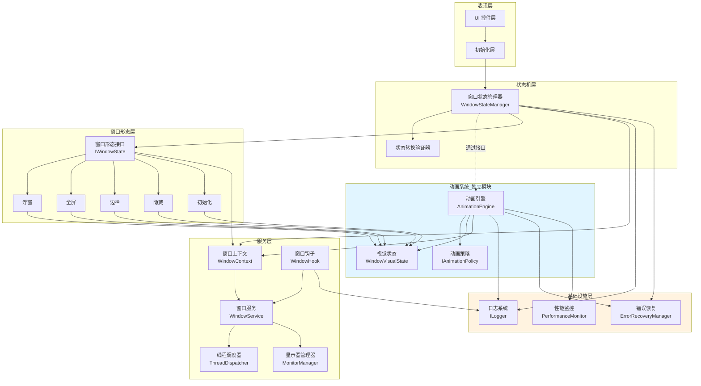
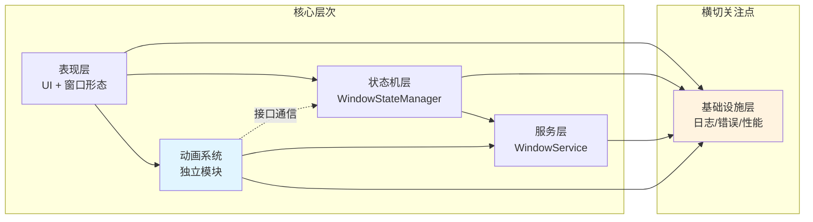
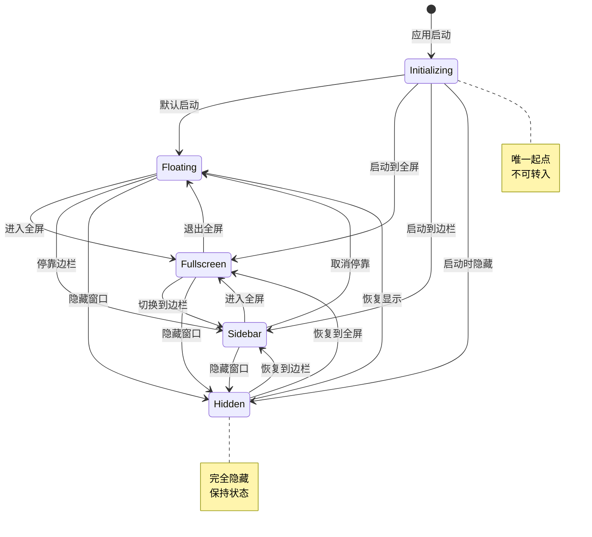
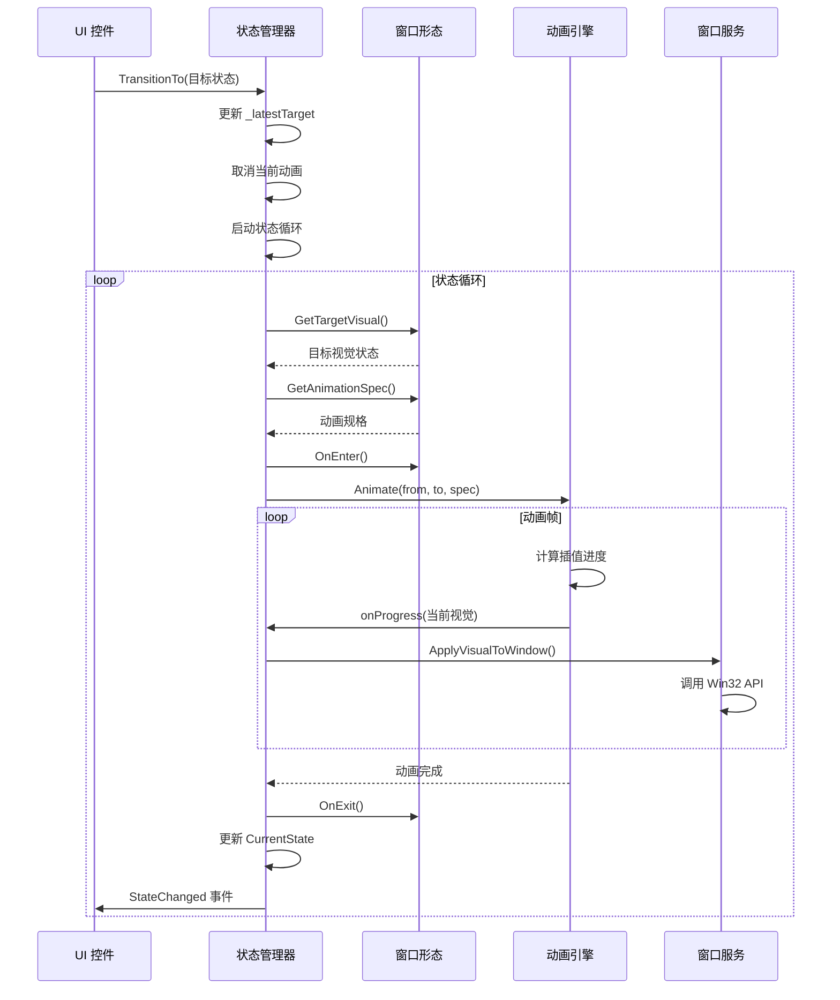

# 需求文档

## 简介

本文档定义了 Docked Tools 主窗口重构的业务需求和验收标准。该重构旨在解决当前主窗口模块代码耦合度高、职责划分不清晰的问题，通过建立清晰的三层架构（服务层、状态机、表现层）来提高代码的可维护性和可测试性。

## 迁移方案

### 迁移策略

采用**渐进式迁移**策略，新旧代码并存，逐步替换，确保系统稳定性：

**阶段 1：建立新架构（并行开发）**
- 创建新文件夹 `功能/主窗口v2/`（或 `功能/窗口管理/`）
- 在新文件夹中实现新架构的所有模块
- 旧代码保持不变，继续运行

**阶段 2：适配层对接（双轨运行）**
- 创建适配层，将新架构的 API 暴露给旧代码
- 部分功能开始使用新架构（如焦点管理、动画系统）
- 旧代码逐步调用新架构的服务

**阶段 3：完全切换（一次性替换）**
- 修改 `MainWindow.xaml.cs` 使用新的 WindowStateManager
- 移除旧的 WindowHostController、SlideAnimationController
- 验证所有功能正常

**阶段 4：清理旧代码**
- 删除 `功能/主窗口/` 中的旧文件
- 将 `功能/主窗口v2/` 重命名为 `功能/主窗口/`（可选）

### 文件夹结构对比

**现有结构：**
```
功能/主窗口/
├── 入口/
│   ├── 主窗口.xaml
│   ├── 主窗口.xaml.cs
│   ├── 主窗口工厂.cs
│   └── 调试通知助手.cs
├── 状态/
│   ├── 窗口状态.cs
│   ├── 窗口状态管理器.cs
│   ├── 主窗口视图模型.cs
│   └── 可观察对象.cs
├── 显示隐藏/
│   ├── 窗口宿主控制器.cs
│   ├── 滑动动画控制器.cs
│   └── VisibilityWin32Api.cs
├── 定位尺寸/
│   ├── 窗口布局服务.cs
│   ├── 窗口布局状态.cs
│   └── PlacementWin32Api.cs
└── 外观/
    ├── 标题栏服务.cs
    ├── 背景服务.cs
    └── AppearanceWin32Api.cs
```

**新架构结构：**
```
功能/主窗口v2/          # 或 功能/窗口管理/
├── 服务层/
│   ├── 窗口服务.cs
│   ├── 窗口上下文.cs
│   ├── 线程调度器.cs
│   ├── 窗口钩子.cs
│   └── Win32互操作/
│       ├── DWM互操作.cs
│       ├── 窗口样式互操作.cs
│       ├── 窗口位置互操作.cs
│       ├── 显示器管理器.cs
│       └── 焦点管理互操作.cs
├── 状态机/
│   ├── 窗口状态管理器.cs
│   ├── 窗口状态.cs
│   ├── 状态转换验证器基类.cs
│   └── 事件/
├── 动画系统/
│   ├── 引擎/
│   │   ├── 动画引擎.cs
│   │   ├── 动画驱动接口.cs
│   │   ├── 动画组合器.cs
│   │   └── 插值器/
│   ├── 视觉状态/
│   ├── 策略/
│   └── 预设/
├── 窗口形态/
│   ├── 窗口形态接口.cs
│   ├── 浮窗.cs
│   ├── 全屏窗口.cs
│   ├── 边栏窗口.cs
│   ├── 隐藏窗口.cs
│   └── 初始化窗口.cs
├── 初始化/
│   ├── 窗口初始化器.cs
│   └── 延迟加载管理器.cs
└── 基础设施/
    ├── 日志/
    ├── 错误处理/
    └── 性能/
```

**保留的文件（继续使用）：**
```
功能/主窗口/入口/
├── 主窗口.xaml          # 保留，UI 定义不变
├── 主窗口.xaml.cs       # 修改，使用新的 WindowStateManager
└── 主窗口工厂.cs        # 保留，继续使用

功能/主窗口/外观/
├── 标题栏服务.cs        # 保留，可能需要适配
└── 背景服务.cs          # 保留，可能需要适配
```

### 迁移步骤

**步骤 1：创建新文件夹结构**
```bash
mkdir -p 功能/主窗口v2/服务层/Win32互操作
mkdir -p 功能/主窗口v2/状态机/事件
mkdir -p 功能/主窗口v2/动画系统/引擎/插值器
mkdir -p 功能/主窗口v2/窗口形态
mkdir -p 功能/主窗口v2/初始化
mkdir -p 功能/主窗口v2/基础设施
```

**步骤 2：实现新架构核心模块**
- 实现 WindowService（Win32 API 抽象）
- 实现 WindowContext（窗口上下文）
- 实现 AnimationEngine（动画引擎）
- 实现 WindowStateManager（状态机）
- 实现各窗口形态（FloatingWindow、FullscreenWindow 等）

**步骤 3：创建适配层**
- 在 `功能/主窗口v2/适配层/` 创建适配器
- 将新架构的 API 暴露给旧代码使用

**步骤 4：修改 MainWindow.xaml.cs**
- 移除对 WindowHostController 的依赖
- 创建 WindowStateManager 实例
- 订阅状态变化事件
- 更新 UI 控件的事件处理器

**步骤 5：测试和验证**
- 测试所有窗口状态转换
- 测试动画效果
- 测试焦点管理
- 测试多显示器支持

**步骤 6：清理旧代码**
- 删除 `功能/主窗口/显示隐藏/`
- 删除 `功能/主窗口/定位尺寸/`
- 删除 `功能/主窗口/状态/` 中的旧状态管理器
- 可选：重命名 `功能/主窗口v2/` 为 `功能/主窗口/`

### 风险控制

**风险 1：功能回归**
- 缓解措施：保持旧代码可用，出问题可快速回滚
- 缓解措施：充分的单元测试和集成测试

**风险 2：性能下降**
- 缓解措施：性能监控和基准测试
- 缓解措施：动画引擎优化

**风险 3：兼容性问题**
- 缓解措施：适配层确保 API 兼容
- 缓解措施：渐进式迁移，逐步替换

### 回滚方案

如果新架构出现严重问题，可以快速回滚：
1. 恢复 `MainWindow.xaml.cs` 到旧版本
2. 删除 `功能/主窗口v2/` 文件夹
3. 旧代码继续运行

## 术语表

- **WindowService**: Win32 API 静态抽象层，提供无状态的窗口操作函数
- **WindowStateManager**: 窗口状态机，负责管理状态转换和动画调度
- **WindowState**: 窗口状态枚举（Initializing, Hidden, Floating, Fullscreen, Sidebar）
- **WindowVisualState**: 窗口视觉状态快照，定义窗口的完整外观属性
- **IWindowState**: 窗口形态接口，各窗口形态实现此接口定义目标视觉和动画偏好
- **AnimationEngine**: 统一动画引擎，负责执行视觉状态插值
- **AnimationSpec**: 动画规格，定义动画时长、缓动函数等参数
- **IAnimationPolicy**: 全局动画策略接口，统一管理动画参数
- **WindowContext**: 窗口上下文，集中管理 HWND 和核心引用，提供窗口实例和当前视觉状态的访问
- **IWindowPositionService**: 窗口位置服务，负责保存和恢复浮窗位置、尺寸以及与屏幕边缘的距离
- **ThreadDispatcher**: 线程调度器，确保所有 Win32 API 调用在 UI 线程（STA）执行
- **WindowHook**: 窗口钩子，用于拦截和处理窗口消息
- **MonitorManager**: 显示器管理器，处理多显示器环境
- **ErrorRecoveryManager**: 错误恢复管理器，提供优雅的错误处理机制
- **AppBar**: Windows Shell AppBar，允许窗口占用屏幕工作区，通过 SHAppBarMessage API 注册

## 架构概览

### 整体架构图



### 模块依赖关系图



### 文件组织结构图

```mermaid
graph TB
    Root[窗口管理/]
    
    Root --> Service[服务层/]
    Root --> StateMachine[状态机/]
    Root --> Animation[动画系统/]
    Root --> WindowStates[窗口形态/]
    Root --> Init[初始化/]
    Root --> Infra[基础设施/]
    
    Service --> WS[窗口服务.cs]
    Service --> WC[窗口上下文.cs]
    Service --> TD[线程调度器.cs]
    Service --> WH[窗口钩子.cs]
    Service --> Win32[Win32互操作/]
    
    Win32 --> DWM[DWM互操作.cs]
    Win32 --> Style[窗口样式互操作.cs]
    Win32 --> Pos[窗口位置互操作.cs]
    Win32 --> Mon[显示器管理器.cs]
    Win32 --> Focus[焦点管理互操作.cs]
    
    StateMachine --> SM[窗口状态管理器.cs]
    StateMachine --> WSEnum[窗口状态.cs]
    StateMachine --> Val[状态转换验证器基类.cs]
    StateMachine --> Events[事件/]
    
    Animation --> Engine[引擎/]
    Animation --> Visual[视觉状态/]
    Animation --> Policy[策略/]
    Animation --> Presets[预设/]
    
    Engine --> AE[动画引擎.cs]
    Engine --> Driver[动画驱动接口.cs]
    Engine --> Composer[动画组合器.cs]
    Engine --> Interp[插值器/]
    
    WindowStates --> IWS[窗口形态接口.cs]
    WindowStates --> Float[浮窗.cs]
    WindowStates --> Full[全屏窗口.cs]
    WindowStates --> Side[边栏窗口.cs]
    WindowStates --> Hidden[隐藏窗口.cs]
    WindowStates --> InitW[初始化窗口.cs]
    
    Init --> Initializer[窗口初始化器.cs]
    Init --> Lazy[延迟加载管理器.cs]
    
    Infra --> Log[日志/]
    Infra --> Error[错误处理/]
    Infra --> Perf[性能/]
    
    style Animation fill:#e1f5ff
    style Infra fill:#fff3e0
```



### 状态转换流程图



### 动画执行流程图



## 需求

### 需求 1: 窗口状态管理

**用户故事:** 作为开发者，我希望窗口状态管理清晰明确，以便理解和维护窗口的各种显示模式。

#### 验收标准

1. THE WindowStateManager SHALL 支持五种互斥的窗口状态：Initializing、Hidden、Floating、Fullscreen、Sidebar
2. WHEN 窗口首次创建时 THEN THE WindowStateManager SHALL 将状态设置为 Initializing
3. WHEN 从 Initializing 状态转换时 THEN THE WindowStateManager SHALL 只允许转换到 Floating、Fullscreen、Sidebar 或 Hidden 状态
4. WHEN 从任何可见状态（Floating、Fullscreen、Sidebar）转换时 THEN THE WindowStateManager SHALL 允许转换到任何其他状态
5. WHEN 从 Hidden 状态转换时 THEN THE WindowStateManager SHALL 允许转换到任何可见状态
6. THE WindowStateManager SHALL 禁止从任何状态转换回 Initializing 状态

### 需求 2: 状态转换请求处理

**用户故事:** 作为用户，我希望窗口能够快速响应我的操作，即使我快速切换多个状态，系统也能平滑处理。

#### 验收标准

1. WHEN TransitionTo 方法被调用时 THEN THE WindowStateManager SHALL 立即返回而不等待动画完成
2. WHEN 多个 TransitionTo 请求快速连续发出时 THEN THE WindowStateManager SHALL 只执行到最后一个目标状态的转换
3. WHEN 多个 TransitionTo 请求快速连续发出时 THEN THE WindowStateManager SHALL NOT 排队中间转换，而是始终收敛到最新的目标状态
4. THE WindowStateManager SHALL 压缩转换过程本身，而不仅仅是压缩结果
5. WHEN 新的 TransitionTo 请求到达时 THEN THE WindowStateManager SHALL 取消当前正在执行的动画
6. WHEN TransitionTo 从非 UI 线程调用时 THEN THE WindowStateManager SHALL 自动将调用转发到 UI 线程
7. THE WindowStateManager SHALL 使用单线程状态循环处理所有状态转换请求

### 需求 3: 动画系统

**用户故事:** 作为用户，我希望窗口状态切换时有流畅的动画效果，让界面变化更加自然。

#### 验收标准

1. WHEN 状态转换开始时 THEN THE AnimationEngine SHALL 从当前视觉状态平滑插值到目标视觉状态
2. WHEN 动画被打断时 THEN THE AnimationEngine SHALL 从当前中间视觉状态继续插值到新目标状态
3. WHEN 动画被打断时 THEN THE AnimationEngine SHALL NOT 执行反向动画来恢复到起始状态
4. THE AnimationEngine SHALL 始终从 currentVisual 状态连续插值，不产生视觉跳变
5. THE AnimationEngine SHALL 支持线性插值（LERP）和 Spring 物理模拟两种插值策略
6. THE AnimationEngine SHALL 使用时间驱动而非帧驱动来确保动画时长准确
7. WHEN 动画执行时 THEN THE AnimationEngine SHALL 实时更新窗口的 Bounds、CornerRadius、Opacity 等视觉属性
8. THE AnimationEngine SHALL 支持通过 CancellationToken 立即停止动画

### 需求 4: 视觉状态定义

**用户故事:** 作为开发者，我希望窗口的视觉属性能够统一管理，以便实现一致的动画效果。

#### 验收标准

1. THE WindowVisualState SHALL 包含窗口的完整视觉属性快照（Bounds、CornerRadius、Opacity、IsTopmost、ExtendedStyle）
2. THE WindowVisualState SHALL 支持所有连续量属性的线性插值
3. WHEN 两个 WindowVisualState 进行插值时 THEN THE AnimationEngine SHALL 对所有连续量属性应用相同的插值进度
4. THE WindowVisualState SHALL 不包含离散状态属性（如 IsVisible、IsHitTestVisible）

### 需求 5: 窗口形态实现

**用户故事:** 作为用户，我希望窗口能够以不同的形态显示（浮窗、全屏、边栏），以适应不同的使用场景。

#### 验收标准

1. WHEN FloatingWindow 状态激活时 THEN THE System SHALL 显示一个小型悬浮窗口，圆角 12px，置顶显示
2. WHEN FloatingWindow 状态激活时 THEN THE System SHALL 允许用户调整窗口大小
3. WHEN FloatingWindow 状态激活时 THEN THE System SHALL 通过距离屏幕右侧和任务栏（底部）的距离来定位窗口
4. WHEN FloatingWindow 状态首次激活且没有保存的位置时 THEN THE System SHALL 将窗口停靠在工作区右侧，宽度为工作区宽度的 1/3（最小 380px），高度为工作区高度减去上下边距（各 10px）
5. WHEN FloatingWindow 状态激活且存在上次保存的位置和尺寸时 THEN THE System SHALL 将窗口恢复到上次的位置和尺寸
6. WHEN 用户调整 FloatingWindow 的大小时 THEN THE System SHALL 保持窗口与屏幕右侧和底部的相对距离不变
7. WHEN 离开 FloatingWindow 状态时 THEN THE System SHALL 保存当前窗口的位置、尺寸以及与屏幕边缘的距离
8. WHEN FullscreenWindow 状态激活时 THEN THE System SHALL 显示一个覆盖整个屏幕的窗口，无圆角，不置顶
9. WHEN SidebarWindow 状态激活时 THEN THE System SHALL 显示一个吸附在屏幕右边缘的固定侧边栏（400 x 屏幕高度），无圆角
10. WHEN HiddenWindow 状态激活时 THEN THE System SHALL 将窗口透明度设置为 0.0 并在动画完成后从视觉树中移除
11. WHEN 从 Initializing 转换到 HiddenWindow 时 THEN THE HiddenWindow.GetTargetVisual SHALL 返回 Opacity = 0 的视觉状态，避免渐隐动画导致的闪烁
12. THE IWindowState 实现 SHALL 通过 GetTargetVisual 方法定义目标视觉状态
13. THE IWindowState 实现 SHALL 通过 GetAnimationSpec 方法定义动画规格
14. THE IWindowState 实现 SHALL 通过 OnEnter 钩子控制进入状态时的离散属性（如 IsVisible）
15. THE IWindowState 实现 SHALL 通过 OnExit 钩子控制离开状态时的清理工作
16. THE IWindowState 实现的 OnEnter 钩子 SHALL 是幂等的（可以被多次调用而不产生副作用）
17. WHEN 状态转换被打断时 THEN THE IWindowState 实现 SHALL 能够安全处理 OnEnter 被调用但 OnExit 未被调用的情况
18. WHEN FloatingWindow 或 FullscreenWindow 状态的 OnEnter 钩子被调用时 THEN THE System SHALL 调用 window.Activate() 和 SetForegroundWindow() 尝试获得焦点
19. WHEN 从 Hidden 状态转换到 FloatingWindow 或 FullscreenWindow 时 THEN THE System SHALL 尝试获得输入焦点，如果失败则使用 FlashWindowEx 闪烁窗口吸引用户注意
20. THE System SHALL 使用多层焦点管理策略（Activate → SetForegroundWindow → FlashWindowEx）来提高焦点获取成功率，同时符合 Windows UX 规范

### 需求 6: Win32 API 抽象

**用户故事:** 作为开发者，我希望有清晰的 Win32 API 抽象层，以便在不同模块中复用窗口操作功能。

#### 验收标准

1. THE WindowService SHALL 提供无状态的静态函数集合
2. THE WindowService SHALL 提供 RemoveTitleBar 函数用于移除窗口标题栏
3. THE WindowService SHALL 提供 SetTransparentBackground 函数用于设置透明背景
4. THE WindowService SHALL 提供 SetExtendedStyle 函数用于设置扩展窗口样式
5. THE WindowService SHALL 提供 SetTopmost 函数用于控制窗口置顶
6. THE WindowService SHALL 提供 ShowWindow 和 HideWindow 函数用于控制窗口可见性
7. THE WindowService SHALL 提供 MoveWindow 和 ResizeWindow 函数用于控制窗口位置和尺寸
8. THE WindowService SHALL 提供 SetDwmAttribute 函数用于设置 DWM 属性（如圆角、亚克力效果）
9. THE WindowService SHALL 提供 EnableResize 和 DisableResize 函数用于控制窗口是否可调整大小
10. THE WindowService SHALL 提供 SetForegroundWindow 函数用于将窗口设置为前台窗口并尝试获得输入焦点
11. THE WindowService SHALL 提供 BringWindowToTop 函数用于将窗口提升到 Z 轴顶部
12. THE WindowService SHALL 提供 FlashWindowEx 函数用于闪烁窗口以吸引用户注意（作为焦点获取失败时的降级方案）
13. THE WindowService SHALL 提供 TryBringToFront 函数，使用多层策略（Activate → SetForegroundWindow → FlashWindowEx）尝试将窗口带到前台

### 需求 7: 窗口调整大小和定位

**用户故事:** 作为用户，我希望在 Floating 模式下能够调整窗口大小，并通过与屏幕边缘的距离来控制窗口位置。

#### 验收标准

1. WHEN FloatingWindow 状态激活时 THEN THE System SHALL 启用窗口大小调整功能
2. WHEN 用户调整 FloatingWindow 大小时 THEN THE System SHALL 保持窗口右下角与屏幕右下角的相对距离不变
3. WHEN FloatingWindow 状态保存位置时 THEN THE System SHALL 保存窗口尺寸、距离屏幕右侧的距离、距离任务栏的距离
4. WHEN FloatingWindow 状态恢复位置时 THEN THE System SHALL 根据保存的距离和当前屏幕尺寸计算窗口位置
5. WHEN 屏幕分辨率改变时 THEN THE System SHALL 根据保存的相对距离重新计算窗口位置，确保窗口仍然可见
6. WHEN FullscreenWindow 或 SidebarWindow 状态激活时 THEN THE System SHALL 禁用窗口大小调整功能
7. THE IWindowPositionService SHALL 提供 SaveFloatingPosition 方法保存窗口位置、尺寸和边缘距离
8. THE IWindowPositionService SHALL 提供 GetLastFloatingPosition 方法恢复窗口位置和尺寸

### 需求 8: 首次创建流程

**用户故事:** 作为用户，我希望应用启动时窗口能够正确初始化并显示，不出现闪烁或异常。

#### 现有代码实现参考

**MainWindowFactory.cs（窗口工厂）：**

```csharp
public static class MainWindowFactory
{
    /// <summary>
    /// 创建主窗口但不激活
    /// </summary>
    public static global::Docked_AI.MainWindow Create()
    {
        return new global::Docked_AI.MainWindow();
    }

    /// <summary>
    /// 创建并激活主窗口
    /// </summary>
    public static global::Docked_AI.MainWindow CreateAndActivate()
    {
        var window = new global::Docked_AI.MainWindow();
        // 不在这里调用 Activate()，避免闪烁
        // 让调用方（托盘图标管理器）在准备好后再激活
        return window;
    }

    /// <summary>
    /// 获取或创建主窗口
    /// 如果现有窗口无效，则创建新窗口
    /// </summary>
    public static global::Docked_AI.MainWindow GetOrCreate(Window? existingWindow)
    {
        if (IsWindowValid(existingWindow))
        {
            return (global::Docked_AI.MainWindow)existingWindow!;
        }
        return Create();
    }

    /// <summary>
    /// 检查窗口是否有效
    /// </summary>
    public static bool IsWindowValid(Window? window)
    {
        if (window == null) return false;
        
        try
        {
            var windowHandle = WinRT.Interop.WindowNative.GetWindowHandle(window);
            if (windowHandle == IntPtr.Zero) return false;
            return window.Content != null;
        }
        catch
        {
            return false;
        }
    }
}
```

**MainWindow.xaml.cs（窗口构造函数）：**

```csharp
public MainWindow()
{
    InitializeComponent();

    // 第一帧就是亚克力，告别白闪 ✨
    var hwnd = WinRT.Interop.WindowNative.GetWindowHandle(this);
    int acrylic = 3; // DWMSBT_TRANSIENTWINDOW
    DwmSetWindowAttribute(hwnd, 38, ref acrylic, sizeof(int));

    _viewModel = new MainWindowViewModel();
    if (Content is FrameworkElement rootElement)
    {
        rootElement.DataContext = _viewModel;
    }

    _linker = RootGrid.Children.OfType<Linker>().FirstOrDefault();
    _windowController = new WindowHostController(this, _viewModel);

    SubscribeToLinkerEvents();
    _viewModel.PropertyChanged += OnViewModelPropertyChanged;
    AppWindow.Changed += OnAppWindowChanged;
    Closed += OnWindowClosed;

    RefreshViewModelDrivenState();
    RefreshWindowChromeState();
}
```

**WindowHostController.cs（初始化和首次显示）：**

```csharp
public WindowHostController(Window window, MainWindowViewModel viewModel, int animationTimeoutMs = DefaultAnimationTimeoutMs)
{
    _window = window;
    _viewModel = viewModel;
    _layoutService = new WindowLayoutService();
    _state = _layoutService.CreateInitialState();
    
    _titleBarService = new TitleBarService();
    _backdropService = new BackdropService();
    // ... 其他初始化
}

public void Initialize()
{
    _hwnd = WinRT.Interop.WindowNative.GetWindowHandle(_window);
    
    // Activate() 之前只设置大小和位置，不要 Show/Hide
    // 让 Activate() 作为唯一的"首次显示"触发点
    _layoutService.Refresh(_state);
    _window.AppWindow.IsShownInSwitchers = false;
    
    // 直接设置到目标停靠位置（不需要屏幕外起始位置）
    _window.AppWindow.MoveAndResize(new Windows.Graphics.RectInt32(
        (int)_state.TargetX, 
        (int)_state.TargetY, 
        (int)_state.WindowWidth, 
        (int)_state.WindowHeight));
    
    // ... 其他初始化
}

/// <summary>
/// 请求执行首次显示（由托盘图标点击触发）
/// 利用 DWM 的首次 Show 动画，简单优雅
/// </summary>
public void RequestSlideIn()
{
    System.Diagnostics.Debug.WriteLine("RequestSlideIn: Showing window with DWM animation");

    // 1. 确保窗口在目标停靠位置
    _layoutService.Refresh(_state);
    _window.AppWindow.MoveAndResize(new Windows.Graphics.RectInt32(
        (int)_state.TargetX, 
        (int)_state.TargetY, 
        (int)_state.WindowWidth, 
        (int)_state.WindowHeight));

    // 2. 激活窗口（触发 DWM 的首次显示动画）
    _window.Activate();
    
    // 3. 确保窗口获得焦点
    ActivateAndFocusWindow();
    
    // 4. 更新状态到 Windowed
    var plan = _stateManager.CreatePlan(WindowState.Windowed, "Initial window shown");
    if (plan != null)
    {
        _ = ExecuteTransitionPlanAsync(plan);
    }
}
```

**TrayIconManager.cs（托盘图标管理器创建窗口）：**

```csharp
private void CreateAndShowWindow()
{
    // 使用窗口工厂创建窗口（如果提供），否则使用主窗口工厂创建默认窗口
    // 注意：不要在这里调用 Activate()，让 RequestSlideIn() 来触发首次显示
    _mainWindow = _windowFactory?.Invoke() ?? MainWindowFactory.Create();
    
    // 标记初始化完成
    if (_mainWindow is IWindowToggle windowToggle)
    {
        windowToggle.SetInitializingComplete();
        
        System.Diagnostics.Debug.WriteLine("TrayIconManager: Initialization complete, requesting first show");
        
        // 触发首次显示，利用 DWM 的创建动画 ✨
        windowToggle.RequestSlideIn();
    }
}
```

**WindowLayoutService.cs（窗口布局服务）：**

```csharp
public WindowLayoutState CreateInitialState()
{
    var state = new WindowLayoutState();
    Refresh(state);
    return state;
}

public void Refresh(WindowLayoutState state)
{
    state.ScreenHeight = PlacementWin32Api.GetSystemMetrics(PlacementWin32Api.SM_CYSCREEN);
    state.ScreenWidth = PlacementWin32Api.GetSystemMetrics(PlacementWin32Api.SM_CXSCREEN);
    PlacementWin32Api.SystemParametersInfo(PlacementWin32Api.SPI_GETWORKAREA, 0, ref state.WorkArea, 0);

    int availableWidth = state.WorkArea.Right - state.WorkArea.Left - (state.Margin * 2);
    if (state.WindowWidth <= 0)
    {
        state.WindowWidth = availableWidth / 3;  // 默认宽度为工作区的 1/3
    }

    state.WindowWidth = Math.Max(state.MinWindowWidth, state.WindowWidth);
    state.WindowWidth = Math.Min(availableWidth, state.WindowWidth);
    state.WindowHeight = state.WorkArea.Bottom - state.WorkArea.Top - (state.Margin * 2);
    state.TargetX = state.WorkArea.Right - state.WindowWidth - state.Margin;  // 停靠在右侧
    state.TargetY = state.WorkArea.Top + state.Margin;
    state.CurrentY = state.TargetY;
}
```

#### 验收标准

1. WHEN 窗口首次创建时 THEN THE System SHALL 使用 MainWindowFactory.Create() 创建窗口但不立即激活
2. WHEN 窗口创建后 THEN THE System SHALL 在调用 Activate() 之前完成所有初始化设置（创建 WindowContext、AnimationEngine、WindowStateManager 等）
3. WHEN Activate() 被调用后 THEN THE System SHALL 将窗口状态从 Initializing 转换到目标可见状态（Floating、Fullscreen 或 Sidebar）
4. IF 应用需要启动时隐藏窗口 THEN THE System SHALL 在 Activate() 之前设置 Opacity 为 0
5. IF 应用需要启动时隐藏窗口 THEN THE System SHALL 在第一帧完成后调用 WindowStateManager.TransitionTo(WindowState.Hidden)
6. WHEN 从 Initializing 转换到 Hidden 时 THEN THE System SHALL 确保窗口始终不可见（Opacity = 0 或 IsVisible = false），避免闪烁
7. THE System SHALL 使用 DispatcherQueue 在第一帧完成后执行状态转换
8. THE MainWindowFactory SHALL 提供 Create() 方法用于创建窗口但不激活
9. THE MainWindowFactory SHALL 提供 CreateAndActivate() 方法用于创建并激活窗口
10. THE MainWindowFactory SHALL 提供 GetOrCreate() 方法用于获取或创建有效的窗口实例
11. THE MainWindowFactory SHALL 提供 IsWindowValid() 方法用于检查窗口是否有效
12. WHEN 窗口首次显示时 THEN THE System SHALL 使用 DWM 的首次显示动画，避免自定义动画导致的闪烁
13. WHEN 窗口首次显示时 THEN THE System SHALL 将窗口宽度设置为工作区宽度的 1/3，高度设置为工作区高度减去边距
14. WHEN 窗口首次显示时 THEN THE System SHALL 将窗口停靠在屏幕右侧，距离右边缘一个 Margin 的距离
15. THE System SHALL 使用默认边距值 10 像素作为窗口与屏幕边缘的距离
16. WHEN 窗口停靠在屏幕右侧时 THEN THE System SHALL 保持窗口距离屏幕顶部 10 像素、距离任务栏（底部）10 像素、距离屏幕右侧 10 像素

### 需求 9: 状态转换事件通知

**用户故事:** 作为开发者，我希望能够监听窗口状态变化事件，以便在状态转换时执行相应的业务逻辑。

#### 验收标准

1. WHEN 状态转换开始时 THEN THE WindowStateManager SHALL 触发 TransitionStarted 事件，包含起始状态和目标状态
2. WHEN 状态转换完成时 THEN THE WindowStateManager SHALL 触发 StateChanged 事件，包含起始状态和最终状态
3. THE WindowStateManager SHALL 提供 CurrentState 只读属性表示当前稳定状态
4. THE WindowStateManager SHALL 提供 TransitioningTo 只读属性表示正在转换到的目标状态（null 表示无转换）
5. WHEN 没有正在进行的转换时 THEN THE TransitioningTo 属性 SHALL 返回 null
6. THE WindowStateManager SHALL 通过 TransitioningTo 属性区分稳定状态和转换中状态
7. WHEN 查询窗口是否处于稳定状态时 THEN 外部系统 SHALL 检查 TransitioningTo 是否为 null
8. WHEN 查询窗口最终会到达的状态时 THEN 外部系统 SHALL 使用表达式 `TransitioningTo ?? CurrentState`

### 需求 10: 动画规格定制

**用户故事:** 作为开发者，我希望能够根据不同的状态转换场景定制动画参数，以提供最佳的用户体验。

#### 验收标准

1. THE AnimationSpec SHALL 支持定义动画时长（Duration）
2. THE AnimationSpec SHALL 支持定义缓动函数（Easing）
3. THE AnimationSpec SHALL 支持针对不同属性使用不同的缓动函数
4. THE AnimationSpec SHALL 支持 Spring 物理模拟配置（Stiffness 和 Damping）
5. WHEN IWindowState 实现 GetAnimationSpec 方法时 THEN THE System SHALL 允许根据起始和目标视觉状态动态调整动画参数
6. WHERE 距离很近时 THE IWindowState 实现 SHALL 能够缩短动画时长
7. WHERE 距离很远时 THE IWindowState 实现 SHALL 能够使用 Spring 插值使动画更自然

### 需求 11: 全局动画策略（已废弃，参见需求 29）

**用户故事:** 作为产品设计师，我希望所有窗口状态转换的动画效果保持一致，以提供统一的用户体验。

**注意：本需求已被需求 29 替代，需求 29 明确了动画参数的归属和优先级。**

#### 验收标准

1. THE IAnimationPolicy SHALL 提供 Resolve 方法，根据起始状态、目标状态和当前视觉状态返回动画规格
2. WHEN IAnimationPolicy 被注入到 WindowStateManager 时 THEN THE System SHALL 优先使用策略的 Resolve 方法而非各状态的 GetAnimationSpec 方法
3. WHEN IAnimationPolicy 返回非空动画规格时 THEN THE System SHALL 使用该规格覆盖状态特定的动画配置
4. WHEN IAnimationPolicy 返回空值时 THEN THE System SHALL 回退到使用目标状态的 GetAnimationSpec 方法
5. THE System SHALL NOT 混合全局动画策略和状态特定动画配置的参数
6. WHEN 快速连续切换状态时 THEN THE IAnimationPolicy SHALL 使用较短时长的快速动画和简单缓动函数
7. THE IAnimationPolicy SHALL 根据转换类型（进入全屏、退出全屏、停靠边栏、浮动、隐藏、显示）提供不同的动画参数
8. WHEN 进入全屏时 THEN THE IAnimationPolicy SHALL 使用较长时长的 Spring 动画以提供自然的放大效果
9. WHEN 退出全屏时 THEN THE IAnimationPolicy SHALL 使用中等时长的 EaseOut 缓动以提供平滑的缩小效果
10. WHEN 停靠到边栏时 THEN THE IAnimationPolicy SHALL 使用中等时长的 EaseOut 缓动以提供流畅的移动效果
11. WHEN 显示或隐藏窗口时 THEN THE IAnimationPolicy SHALL 使用较短时长的动画以提供快速响应

### 需求 12: 资源管理

**用户故事:** 作为系统管理员，我希望应用能够正确管理资源，避免内存泄漏和资源浪费。

#### 验收标准

1. WHEN TransitionTo 创建新的 CancellationTokenSource 时 THEN THE WindowStateManager SHALL 取消并释放旧的 CancellationTokenSource
2. THE WindowStateManager SHALL 使用原子操作（Interlocked.Exchange）替换 CancellationTokenSource 以避免竞态条件
3. WHEN 动画完成或被取消时 THEN THE WindowStateManager SHALL 释放该动画的 CancellationTokenSource
4. THE WindowStateManager SHALL 使用快照模式防止误释放新一轮的 CancellationTokenSource

### 需求 13: 多显示器支持

**用户故事:** 作为用户，我希望窗口能够在多显示器环境下正确显示，适应不同的屏幕尺寸和位置。

#### 验收标准

1. WHEN FullscreenWindow 状态激活时 THEN THE System SHALL 获取当前显示器的完整尺寸并覆盖整个屏幕
2. WHEN SidebarWindow 状态激活时 THEN THE System SHALL 获取当前显示器的尺寸并吸附在屏幕右边缘
3. THE IWindowState 实现 SHALL 提供 GetCurrentScreen 方法用于获取当前显示器信息

### 需求 14: 边栏工作区管理

**用户故事:** 作为用户，我希望边栏模式能够正确占用屏幕工作区，使其他窗口不会与边栏重叠。

#### 验收标准

1. WHEN SidebarWindow 状态的 OnEnter 钩子被调用时 THEN THE System SHALL 通过 SHAppBarMessage(ABM_NEW, ...) 将窗口注册为 AppBar
2. WHEN SidebarWindow 状态的 OnExit 钩子被调用时 THEN THE System SHALL 通过 SHAppBarMessage(ABM_REMOVE, ...) 取消 AppBar 注册
3. THE SidebarWindow SHALL 通过 SHAppBarMessage(ABM_SETPOS, ...) 设置 AppBar 的位置和尺寸以占用屏幕工作区

### 需求 15: 渐显渐隐动画

**用户故事:** 作为用户，我希望窗口显示和隐藏时有平滑的渐显渐隐效果，而不是突然出现或消失。

#### 验收标准

1. WHEN 从 Hidden 状态转换到可见状态时 THEN THE System SHALL 在动画开始前设置 IsVisible 为 true，然后将 Opacity 从 0.0 插值到 1.0
2. WHEN 从可见状态转换到 Hidden 状态时 THEN THE System SHALL 保持 IsVisible 为 true 直到动画完成，将 Opacity 从 1.0 插值到 0.0，然后在 OnExit 钩子中设置 IsVisible 为 false
3. THE HiddenWindow SHALL 在 GetTargetVisual 方法中保持当前位置和尺寸，只改变 Opacity 为 0.0

### 需求 16: 动画打断处理

**用户故事:** 作为用户，我希望在动画执行过程中能够立即响应新的操作，动画能够平滑地从当前状态过渡到新目标。

#### 验收标准

1. WHEN 动画执行过程中收到新的 TransitionTo 请求时 THEN THE AnimationEngine SHALL 立即停止当前动画
2. WHEN 动画被打断时 THEN THE WindowStateManager SHALL 保持 _currentVisual 在当前中间状态
3. WHEN 开始新的动画时 THEN THE AnimationEngine SHALL 从中间视觉状态插值到新目标视觉状态
4. THE WindowStateManager SHALL 不需要执行反向动画来恢复到起始状态

### 需求 17: 动画时间精度

**用户故事:** 作为用户，我希望动画时长准确，不会因为系统负载或帧率波动而变慢或变快。

#### 验收标准

1. THE AnimationEngine SHALL 使用 Stopwatch 测量真实经过的时间
2. THE AnimationEngine SHALL 根据真实时间计算动画进度，而非依赖帧数
3. WHEN 系统掉帧时 THEN THE AnimationEngine SHALL 确保动画仍然准时完成，只是减少中间帧数
4. THE AnimationEngine SHALL 使用约 60 FPS 的帧率（每帧约 16ms）作为目标刷新率

### 需求 18: 状态查询接口

**用户故事:** 作为开发者，我希望能够查询窗口的当前状态和转换状态，以便在业务逻辑中做出相应的决策。

#### 验收标准

1. THE WindowStateManager SHALL 提供 CurrentState 属性返回当前稳定状态
2. THE WindowStateManager SHALL 提供 TransitioningTo 属性返回正在转换到的目标状态
3. WHEN 没有正在进行的转换时 THEN THE TransitioningTo 属性 SHALL 返回 null
4. WHEN 查询"最终会到达的状态"时 THEN THE 调用者 SHALL 使用表达式 `TransitioningTo ?? CurrentState`
5. THE System SHALL 提供方法用于查询当前是否可以执行特定操作

### 需求 19: 日志和遥测

**用户故事:** 作为系统管理员，我希望能够记录窗口状态转换的完整生命周期，以便排查问题和分析用户行为。

#### 验收标准

1. WHEN TransitionStarted 事件触发时 THEN THE System SHALL 记录起始状态和目标状态
2. WHEN StateChanged 事件触发时 THEN THE System SHALL 记录起始状态和最终状态
3. THE System SHALL 提供足够的信息用于追踪状态转换的完整生命周期

### 需求 20: 动画引擎扩展性

**用户故事:** 作为开发者，我希望动画引擎能够支持未来的优化和扩展，如使用 CompositionAnimation 提高性能。

#### 验收标准

1. THE AnimationEngine SHALL 支持线性插值（LERP）作为基础插值策略
2. THE AnimationEngine SHALL 支持 Spring 物理模拟作为高级插值策略
3. THE AnimationEngine 设计 SHALL 允许未来迁移到 CompositionAnimation 而不影响状态机逻辑
4. THE AnimationEngine SHALL 通过统一的接口执行所有插值逻辑，便于替换底层实现
5. THE AnimationEngine SHALL 通过 IAnimationDriver 接口与具体插值实现解耦

### 需求 21: 状态查询和操作限制

**用户故事:** 作为开发者，我希望能够查询窗口状态并根据状态限制某些操作，以避免在不合适的时机执行操作。

#### 验收标准

1. WHEN 窗口正在转换状态时（TransitioningTo != null）THEN THE System SHALL 禁用与状态冲突的操作
2. THE System SHALL 提供方法用于查询当前是否可以执行特定操作

### 需求 22: UI 交互反馈和用户体验

**用户故事:** 作为用户，我希望在窗口状态转换过程中能够获得清晰的视觉反馈，了解当前操作的状态和可用性。

#### 验收标准

1. WHEN 窗口正在转换状态时（TransitioningTo != null）THEN THE UI SHALL 显示视觉指示器（如加载动画或进度条）
2. WHEN 用户尝试执行被禁用的操作时 THEN THE System SHALL 显示临时提示信息说明操作不可用的原因
3. WHEN 状态转换完成时（TransitioningTo == null）THEN THE UI SHALL 自动移除所有转换期间的视觉指示器
4. WHEN 用户在转换期间尝试触发新的状态转换时 THEN THE System SHALL 显示简短的通知消息（如"请稍候，正在切换窗口模式"）
5. WHEN 鼠标悬停在操作控件上时 THEN THE System SHALL 显示 Tooltip，正确描述当前状态下哪些操作可用、哪些操作被禁用
6. WHEN 窗口正在转换状态时（TransitioningTo != null）THEN THE UI 控件 SHALL 显示禁用状态或加载指示器，防止用户重复点击

### 需求 23: 错误和异常处理

**用户故事:** 作为用户，我希望在窗口状态转换或动画执行过程中出现异常时，系统能够优雅地处理错误，不会导致应用崩溃或窗口卡在异常状态。

#### 验收标准

1. WHEN 动画执行过程中发生未预期的异常 THEN THE System SHALL 捕获异常并记录详细错误信息
2. WHEN 动画执行失败时 THEN THE WindowStateManager SHALL 将窗口恢复到最近的稳定状态
3. WHEN Win32 API 调用失败时 THEN THE WindowService SHALL 返回错误代码并记录失败原因，而不是抛出未处理的异常
4. WHEN 状态转换过程中发生异常 THEN THE System SHALL 触发 TransitionFailed 事件，包含起始状态、目标状态和异常信息
5. WHEN TransitionFailed 事件被触发时 THEN THE System SHALL 包含导致失败的具体条件和上下文信息
6. WHEN 状态转换失败时 THEN THE System SHALL 尝试重试最多 3 次
7. WHEN 重试 3 次后仍然失败时 THEN THE System SHALL 回退到最后一个稳定状态
8. WHEN 状态转换成功完成时 THEN THE System SHALL 重置失败计数器为 0
9. WHEN 无法获取显示器信息时（如在多显示器环境中显示器被拔出）THEN THE System SHALL 使用主显示器作为后备方案
10. WHEN 动画引擎初始化失败时 THEN THE System SHALL 回退到无动画模式（立即切换状态）
11. THE System SHALL 提供错误恢复机制，允许用户手动重置窗口状态到默认的 Floating 模式
12. WHEN 连续多次状态转换失败时（超过 3 次）THEN THE System SHALL 禁用自动状态转换并通知用户检查系统配置
13. THE WindowStateManager SHALL 在状态转换失败后清理所有中间资源（如 CancellationTokenSource）
14. WHEN 动画过程中窗口句柄（HWND）变为无效时 THEN THE System SHALL 立即停止动画并记录错误

### 需求 24: 现有 UI 控件的向后兼容性

**用户故事:** 作为用户，我希望在系统重构后，现有的快捷键、按钮和托盘图标功能保持不变，以便继续使用熟悉的操作方式。

#### 验收标准

1. WHEN 用户点击全屏按钮时 THEN THE System SHALL 调用 WindowStateManager.TransitionTo(WindowState.Fullscreen) 并正确切换到全屏模式
2. WHEN 用户点击侧边栏按钮时 THEN THE System SHALL 调用 WindowStateManager.TransitionTo(WindowState.Sidebar) 并正确切换到侧边栏模式
3. WHEN 用户点击任务栏托盘按钮时 THEN THE System SHALL 根据当前状态切换窗口可见性（Hidden ↔ 上一个可见状态）
4. WHEN 用户使用快捷键触发窗口状态切换时 THEN THE System SHALL 调用相应的 WindowStateManager.TransitionTo 方法并正确执行状态转换
5. THE System SHALL 保持所有现有快捷键的功能映射不变（如 F11 切换全屏、Ctrl+Shift+S 切换侧边栏等）
6. WHEN 窗口正在转换状态时（TransitioningTo != null）THEN THE UI 控件 SHALL 显示禁用状态或加载指示器，防止用户重复点击
7. WHEN 状态转换完成时 THEN THE UI 控件 SHALL 更新其视觉状态以反映当前窗口状态（如全屏按钮在全屏模式下显示"退出全屏"）
8. THE System SHALL 确保所有 UI 控件的事件处理器正确连接到新的 WindowStateManager API
9. WHEN 用户从托盘恢复窗口时 THEN THE System SHALL 恢复到隐藏前的窗口状态（Floating、Fullscreen 或 Sidebar）
10. THE System SHALL 在重构过程中保持所有 UI 控件的外观和交互行为不变

### 需求 25: 代码组织结构

**用户故事:** 作为开发者，我希望代码按照清晰的模块职责组织，以便快速定位和理解各个模块的功能。

#### 验收标准

1. THE System SHALL 按照三层架构组织代码：服务层（Win32 抽象）、状态机层（状态管理）、表现层（窗口形态）
2. THE System SHALL 将动画系统作为独立模块组织，通过接口与状态机通信，确保动画引擎可以独立测试和替换
3. THE System SHALL 将基础设施（日志、错误处理）作为横切关注点独立组织，供所有层使用
4. THE System SHALL 确保每个模块的职责单一且清晰，避免跨层依赖和循环引用
5. THE System SHALL 将每个窗口形态实现为独立文件，互不依赖
6. THE System SHALL 确保所有状态变更操作在 UI 线程上执行
7. WHEN 从非 UI 线程访问状态机时 THEN THE System SHALL 自动通过 DispatcherQueue 转发到 UI 线程
8. THE WindowStateManager SHALL 保证单线程状态机执行，避免并发状态变更

### 需求 26: 可测试性和单元测试覆盖

**用户故事:** 作为开发者，我希望核心业务逻辑能够通过单元测试验证，以便在重构和功能迭代时保证代码质量。

#### 验收标准

1. THE WindowStateManager SHALL 支持通过 mock IWindowService 进行单元测试，验证状态转换逻辑而不依赖真实的 Win32 API
2. THE AnimationEngine SHALL 支持通过 mock 时间源进行单元测试，验证插值逻辑和动画时长计算
3. THE IWindowState 实现 SHALL 支持独立单元测试，验证 GetTargetVisual 和 GetAnimationSpec 方法的返回值
4. THE IAnimationPolicy 实现 SHALL 支持单元测试，验证不同状态转换场景下的动画规格选择逻辑
5. THE WindowService 静态方法 SHALL 提供可测试的接口，允许通过依赖注入或测试替身验证 Win32 API 调用
6. THE System SHALL 确保状态机的核心逻辑（状态转换验证、请求压缩、动画取消）可以通过单元测试覆盖，不依赖 UI 线程或真实窗口
7. THE System SHALL 提供测试辅助工具（如 TestAnimationEngine、MockWindowService）以简化单元测试编写
8. THE System SHALL 确保至少 80% 的核心业务逻辑代码被单元测试覆盖
9. 通过阻断式弹窗实现实际ui流程测试

### 需求 27: 动画打断时的生命周期钩子行为

**用户故事:** 作为开发者，我希望明确了解动画被打断时 OnExit 钩子的调用行为，以便正确管理资源和状态清理。

#### 验收标准

1. WHEN 动画被打断时（OperationCanceledException 被捕获）THEN THE WindowStateManager SHALL NOT 调用旧状态的 OnExit 钩子
2. WHEN 动画被打断时 THEN THE WindowStateManager SHALL 保持 CurrentState 不变，直到新的动画成功完成
3. WHEN 动画被打断时 THEN THE IWindowState 实现 SHALL 能够安全处理 OnEnter 被调用但 OnExit 未被调用的情况
4. THE IWindowState 实现的 OnEnter 钩子 SHALL 是幂等的，可以被多次调用而不产生副作用或资源泄漏
5. THE IWindowState 实现 SHALL 在 OnEnter 中注册的所有资源（如 hooks、timers、event handlers）应该能够在下一次 OnEnter 调用时自动清理或覆盖
6. WHEN 状态转换成功完成时 THEN THE WindowStateManager SHALL 调用旧状态的 OnExit 钩子以确保资源清理

### 需求 28: TransitionFailed 事件的语义和恢复策略

**用户故事:** 作为开发者，我希望明确了解 TransitionFailed 事件的触发条件和恢复策略，以便正确处理状态转换失败的情况。

#### 验收标准

1. WHEN 动画执行过程中抛出异常（除 OperationCanceledException 外）THEN THE WindowStateManager SHALL 触发 TransitionFailed 事件
2. WHEN IWindowState.OnEnter 钩子抛出异常 THEN THE WindowStateManager SHALL 触发 TransitionFailed 事件
3. WHEN IWindowState.OnExit 钩子抛出异常 THEN THE WindowStateManager SHALL 触发 TransitionFailed 事件
4. WHEN Win32 API 调用失败（如 SetWindowPos 返回错误）THEN THE WindowService SHALL 抛出异常，由 WindowStateManager 捕获并触发 TransitionFailed 事件
5. WHEN TransitionFailed 事件被触发时 THEN THE 事件参数 SHALL 包含起始状态、目标状态、异常对象和失败的具体阶段（OnEnter、Animation、OnExit、Win32API）
6. WHEN 状态转换失败时 THEN THE WindowStateManager SHALL 尝试重试最多 3 次，每次重试之间间隔 100ms
7. WHEN 重试 3 次后仍然失败时 THEN THE WindowStateManager SHALL 回退到最后一个稳定状态（_lastStableState）
8. WHEN 状态转换成功完成时 THEN THE WindowStateManager SHALL 重置失败计数器为 0
9. WHEN 连续多次状态转换失败时（超过 3 次）THEN THE WindowStateManager SHALL 禁用自动状态转换并触发 CriticalFailure 事件
10. THE WindowStateManager SHALL 提供 ResetToSafeState 方法，允许用户手动重置窗口状态到默认的 Floating 模式

### 需求 29: 动画参数的归属和优先级

**用户故事:** 作为开发者，我希望明确了解动画参数的来源和优先级，以便正确配置全局动画策略和状态特定动画。

#### 验收标准

1. WHEN IAnimationPolicy 被注入到 WindowStateManager 且 Resolve 方法返回非空值时 THEN THE WindowStateManager SHALL 使用该动画规格，完全覆盖状态特定的 GetAnimationSpec 返回值
2. WHEN IAnimationPolicy 被注入到 WindowStateManager 且 Resolve 方法返回 null 时 THEN THE WindowStateManager SHALL 回退到使用目标状态的 GetAnimationSpec 方法
3. WHEN IAnimationPolicy 未被注入到 WindowStateManager 时 THEN THE WindowStateManager SHALL 始终使用目标状态的 GetAnimationSpec 方法
4. THE WindowStateManager SHALL NOT 混合全局动画策略和状态特定动画配置的参数（如使用策略的 Duration 但使用状态的 Easing）
5. THE IAnimationPolicy.Resolve 方法 SHALL 接收三个参数：fromState（上一个稳定状态）、toState（目标状态）、currentVisual（当前实际视觉状态）
6. THE IAnimationPolicy 实现 SHALL 能够根据 fromState 和 toState 的组合返回一致的动画规格，确保相同的状态转换每次都使用相同的动画参数
7. THE IAnimationPolicy 实现 SHALL 能够根据 currentVisual 动态调整动画参数（如根据距离调整时长），但不应该改变动画的基本风格（如缓动函数类型）
8. THE System SHALL 在文档中明确说明：IAnimationPolicy 是全局动画风格的主导，IWindowState.GetAnimationSpec 是后备方案

### 需求 30: Initializing 到 Hidden 的启动时隐藏行为

**用户故事:** 作为用户，我希望应用启动时能够正确隐藏窗口（如托盘应用），不出现闪烁或异常。

#### 验收标准

1. WHEN 应用需要启动时隐藏窗口时 THEN THE System SHALL 在调用 Activate() 之前设置 window.Opacity = 0
2. WHEN 应用需要启动时隐藏窗口时 THEN THE System SHALL 在第一帧完成后调用 WindowStateManager.TransitionTo(WindowState.Hidden)
3. WHEN 从 Initializing 转换到 Hidden 时 THEN THE HiddenWindow.GetTargetVisual SHALL 保持 Opacity = 0，避免渐隐动画导致的闪烁
4. WHEN 从 Initializing 转换到 Hidden 时 THEN THE HiddenWindow.OnExit SHALL 设置 IsVisible = false，将窗口从视觉树中移除
5. THE System SHALL 确保从 Initializing 到 Hidden 的转换过程中窗口始终不可见（Opacity = 0 或 IsVisible = false）
6. THE System SHALL 在文档中明确说明：启动时隐藏窗口需要在 Activate() 之前设置 Opacity = 0，而不是在 Activate() 之后调用 TransitionTo(Hidden)

### 需求 31: 动画参数计算使用稳定状态

**用户故事:** 作为用户，我希望窗口状态转换的动画效果保持一致，不会因为中间状态而产生不同的动画参数。

#### 验收标准

1. WHEN 计算动画参数时 THEN THE WindowStateManager SHALL 使用 _lastStableState（上一个稳定状态）而非 CurrentState（可能是中间状态）
2. WHEN IAnimationPolicy.Resolve 被调用时 THEN THE fromState 参数 SHALL 等于 _lastStableState，而不是 CurrentState
3. WHEN 快速连续切换状态时（如 Floating → Fullscreen → Sidebar）THEN THE 最终动画的 fromState 参数 SHALL 等于 Floating（第一个稳定状态），而不是 Fullscreen（中间请求的状态）
4. WHEN 动画成功完成时 THEN THE WindowStateManager SHALL 更新 _lastStableState = CurrentState，为下一次转换做准备
5. WHEN 动画被打断时 THEN THE WindowStateManager SHALL NOT 更新 _lastStableState，保持其指向上一个真正稳定的状态
6. THE System SHALL 使用 _currentVisual（当前实际视觉状态）作为动画的起点，确保视觉连续性
7. THE System SHALL 在文档中明确说明：_lastStableState 用于动画参数计算，_currentVisual 用于动画起点，两者职责不同
