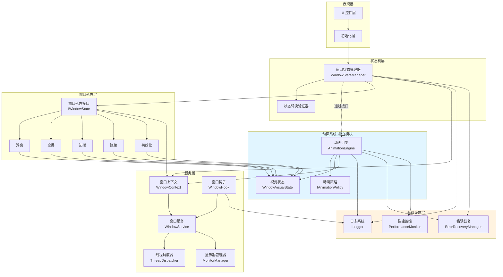
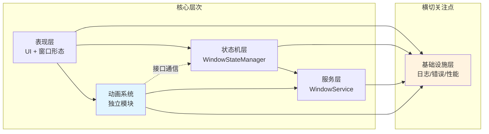
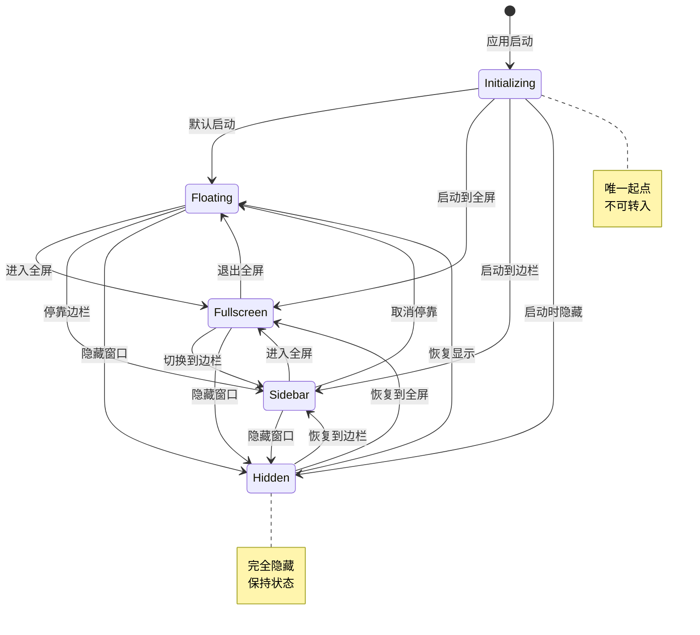
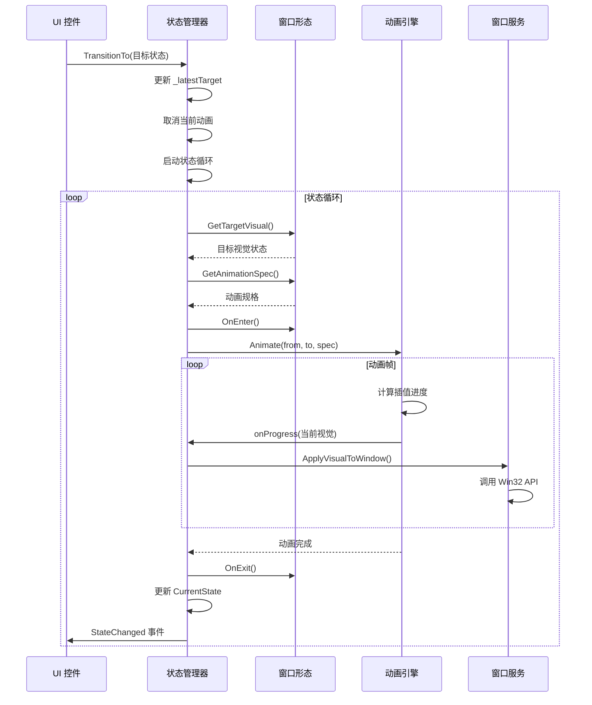

# 需求文档

## 简介

本文档定义了 Docked Tools 主窗口重构的业务需求和验收标准。该重构旨在解决当前主窗口模块代码耦合度高、职责划分不清晰的问题，通过建立清晰的三层架构（服务层、状态机、表现层）来提高代码的可维护性和可测试性。

## 术语表

- **WindowService**: Win32 API 静态抽象层，提供无状态的窗口操作函数
- **WindowStateManager**: 窗口状态机，负责管理状态转换和动画调度
- **WindowState**: 窗口状态枚举（Initializing, Hidden, Floating, Fullscreen, Sidebar）
- **WindowVisualState**: 窗口视觉状态快照，定义窗口的完整外观属性
- **IWindowState**: 窗口形态接口，各窗口形态实现此接口定义目标视觉和动画偏好
- **AnimationEngine**: 统一动画引擎，负责执行视觉状态插值
- **AnimationSpec**: 动画规格，定义动画时长、缓动函数等参数
- **IAnimationPolicy**: 全局动画策略接口，统一管理动画参数
- **WindowContext**: 窗口上下文，集中管理 HWND 和核心引用
- **ThreadDispatcher**: 线程调度器，确保所有 Win32 API 调用在 UI 线程（STA）执行
- **WindowHook**: 窗口钩子，用于拦截和处理窗口消息
- **MonitorManager**: 显示器管理器，处理多显示器环境
- **ErrorRecoveryManager**: 错误恢复管理器，提供优雅的错误处理机制

## 架构概览

### 整体架构图

### 模块依赖关系图

### 文件组织结构图

```mermaid
graph TB
    Root[窗口管理/]
    
    Root --> Service[服务层/]
    Root --> StateMachine[状态机/]
    Root --> Animation[动画系统/]
    Root --> WindowStates[窗口形态/]
    Root --> Init[初始化/]
    Root --> Infra[基础设施/]
    
    Service --> WS[窗口服务.cs]
    Service --> WC[窗口上下文.cs]
    Service --> TD[线程调度器.cs]
    Service --> WH[窗口钩子.cs]
    Service --> Win32[Win32互操作/]
    
    Win32 --> DWM[DWM互操作.cs]
    Win32 --> Style[窗口样式互操作.cs]
    Win32 --> Pos[窗口位置互操作.cs]
    Win32 --> Mon[显示器管理器.cs]
    
    StateMachine --> SM[窗口状态管理器.cs]
    StateMachine --> WSEnum[窗口状态.cs]
    StateMachine --> Val[状态转换验证器基类.cs]
    StateMachine --> Events[事件/]
    
    Animation --> Engine[引擎/]
    Animation --> Visual[视觉状态/]
    Animation --> Policy[策略/]
    Animation --> Presets[预设/]
    
    Engine --> AE[动画引擎.cs]
    Engine --> Driver[动画驱动接口.cs]
    Engine --> Composer[动画组合器.cs]
    Engine --> Interp[插值器/]
    
    WindowStates --> IWS[窗口形态接口.cs]
    WindowStates --> Float[浮窗.cs]
    WindowStates --> Full[全屏窗口.cs]
    WindowStates --> Side[边栏窗口.cs]
    WindowStates --> Hidden[隐藏窗口.cs]
    WindowStates --> InitW[初始化窗口.cs]
    
    Init --> Initializer[窗口初始化器.cs]
    Init --> Lazy[延迟加载管理器.cs]
    
    Infra --> Log[日志/]
    Infra --> Error[错误处理/]
    Infra --> Perf[性能/]
    
    style Animation fill:#e1f5ff
    style Infra fill:#fff3e0
```

### 状态转换流程图

### 动画执行流程图

## 需求

### 需求 1: 窗口状态管理

**用户故事:** 作为开发者，我希望窗口状态管理清晰明确，以便理解和维护窗口的各种显示模式。

#### 验收标准

1. THE WindowStateManager SHALL 支持五种互斥的窗口状态：Initializing、Hidden、Floating、Fullscreen、Sidebar
2. WHEN 窗口首次创建时 THEN THE WindowStateManager SHALL 将状态设置为 Initializing
3. WHEN 从 Initializing 状态转换时 THEN THE WindowStateManager SHALL 只允许转换到 Floating、Fullscreen、Sidebar 或 Hidden 状态
4. WHEN 从任何可见状态（Floating、Fullscreen、Sidebar）转换时 THEN THE WindowStateManager SHALL 允许转换到任何其他状态
5. WHEN 从 Hidden 状态转换时 THEN THE WindowStateManager SHALL 允许转换到任何可见状态
6. THE WindowStateManager SHALL 禁止从任何状态转换回 Initializing 状态

### 需求 2: 状态转换请求处理

**用户故事:** 作为用户，我希望窗口能够快速响应我的操作，即使我快速切换多个状态，系统也能平滑处理。

#### 验收标准

1. WHEN TransitionTo 方法被调用时 THEN THE WindowStateManager SHALL 立即返回而不等待动画完成
2. WHEN 多个 TransitionTo 请求快速连续发出时 THEN THE WindowStateManager SHALL 只执行到最后一个目标状态的转换
3. WHEN 新的 TransitionTo 请求到达时 THEN THE WindowStateManager SHALL 取消当前正在执行的动画
4. WHEN TransitionTo 从非 UI 线程调用时 THEN THE WindowStateManager SHALL 自动将调用转发到 UI 线程
5. THE WindowStateManager SHALL 使用单线程状态循环处理所有状态转换请求

### 需求 3: 动画系统

**用户故事:** 作为用户，我希望窗口状态切换时有流畅的动画效果，让界面变化更加自然。

#### 验收标准

1. WHEN 状态转换开始时 THEN THE AnimationEngine SHALL 从当前视觉状态平滑插值到目标视觉状态
2. WHEN 动画被打断时 THEN THE AnimationEngine SHALL 从当前中间视觉状态继续插值到新目标状态
3. THE AnimationEngine SHALL 支持线性插值（LERP）和 Spring 物理模拟两种插值策略
4. THE AnimationEngine SHALL 使用时间驱动而非帧驱动来确保动画时长准确
5. WHEN 动画执行时 THEN THE AnimationEngine SHALL 实时更新窗口的 Bounds、CornerRadius、Opacity 等视觉属性
6. THE AnimationEngine SHALL 支持通过 CancellationToken 立即停止动画

### 需求 4: 视觉状态定义

**用户故事:** 作为开发者，我希望窗口的视觉属性能够统一管理，以便实现一致的动画效果。

#### 验收标准

1. THE WindowVisualState SHALL 包含窗口的完整视觉属性快照（Bounds、CornerRadius、Opacity、IsTopmost、ExtendedStyle）
2. THE WindowVisualState SHALL 支持所有连续量属性的线性插值
3. WHEN 两个 WindowVisualState 进行插值时 THEN THE AnimationEngine SHALL 对所有连续量属性应用相同的插值进度
4. THE WindowVisualState SHALL 不包含离散状态属性（如 IsVisible、IsHitTestVisible）

### 需求 5: 窗口形态实现

**用户故事:** 作为用户，我希望窗口能够以不同的形态显示（浮窗、全屏、边栏），以适应不同的使用场景。

#### 验收标准

1. WHEN FloatingWindow 状态激活时 THEN THE System SHALL 显示一个可拖动的小型悬浮窗口（400x600），圆角 12px，置顶显示
2. WHEN FullscreenWindow 状态激活时 THEN THE System SHALL 显示一个覆盖整个屏幕的窗口，无圆角，不置顶
3. WHEN SidebarWindow 状态激活时 THEN THE System SHALL 显示一个吸附在屏幕右边缘的固定侧边栏（400 x 屏幕高度），无圆角
4. WHEN HiddenWindow 状态激活时 THEN THE System SHALL 将窗口透明度设置为 0.0 并在动画完成后从视觉树中移除
5. THE IWindowState 实现 SHALL 通过 GetTargetVisual 方法定义目标视觉状态
6. THE IWindowState 实现 SHALL 通过 GetAnimationSpec 方法定义动画规格
7. THE IWindowState 实现 SHALL 通过 OnEnter 钩子控制进入状态时的离散属性（如 IsVisible）
8. THE IWindowState 实现 SHALL 通过 OnExit 钩子控制离开状态时的清理工作

### 需求 6: Win32 API 抽象

**用户故事:** 作为开发者，我希望有清晰的 Win32 API 抽象层，以便在不同模块中复用窗口操作功能。

#### 验收标准

1. THE WindowService SHALL 提供无状态的静态函数集合
2. THE WindowService SHALL 提供 RemoveTitleBar 函数用于移除窗口标题栏
3. THE WindowService SHALL 提供 SetTransparentBackground 函数用于设置透明背景
4. THE WindowService SHALL 提供 SetExtendedStyle 函数用于设置扩展窗口样式
5. THE WindowService SHALL 提供 SetTopmost 函数用于控制窗口置顶
6. THE WindowService SHALL 提供 ShowWindow 和 HideWindow 函数用于控制窗口可见性
7. THE WindowService SHALL 提供 MoveWindow 和 ResizeWindow 函数用于控制窗口位置和尺寸
8. THE WindowService SHALL 提供 SetDwmAttribute 函数用于设置 DWM 属性（如圆角、亚克力效果）

### 需求 7: 首次创建流程

**用户故事:** 作为用户，我希望应用启动时窗口能够正确初始化并显示，不出现闪烁或异常。

#### 验收标准

1. WHEN 窗口首次创建时 THEN THE System SHALL 在调用 Activate() 之前完成所有初始化设置
2. WHEN Activate() 被调用后 THEN THE System SHALL 将窗口状态从 Initializing 转换到目标可见状态（Floating、Fullscreen 或 Sidebar）
3. IF 应用需要启动时隐藏窗口 THEN THE System SHALL 在 Activate() 之前设置 Opacity 为 0 或通过 Win32 API 设置窗口样式
4. THE System SHALL 使用 DispatcherQueue 在第一帧完成后执行状态转换

### 需求 8: 状态转换事件通知

**用户故事:** 作为开发者，我希望能够监听窗口状态变化事件，以便在状态转换时执行相应的业务逻辑。

#### 验收标准

1. WHEN 状态转换开始时 THEN THE WindowStateManager SHALL 触发 TransitionStarted 事件，包含起始状态和目标状态
2. WHEN 状态转换完成时 THEN THE WindowStateManager SHALL 触发 StateChanged 事件，包含起始状态和最终状态
3. THE WindowStateManager SHALL 提供 CurrentState 只读属性表示当前稳定状态
4. THE WindowStateManager SHALL 提供 TransitioningTo 只读属性表示正在转换到的目标状态（null 表示无转换）
5. WHEN 没有正在进行的转换时 THEN THE TransitioningTo 属性 SHALL 返回 null

### 需求 9: 动画规格定制

**用户故事:** 作为开发者，我希望能够根据不同的状态转换场景定制动画参数，以提供最佳的用户体验。

#### 验收标准

1. THE AnimationSpec SHALL 支持定义动画时长（Duration）
2. THE AnimationSpec SHALL 支持定义缓动函数（Easing）
3. THE AnimationSpec SHALL 支持针对不同属性使用不同的缓动函数
4. THE AnimationSpec SHALL 支持 Spring 物理模拟配置（Stiffness 和 Damping）
5. WHEN IWindowState 实现 GetAnimationSpec 方法时 THEN THE System SHALL 允许根据起始和目标视觉状态动态调整动画参数
6. WHERE 距离很近时 THE IWindowState 实现 SHALL 能够缩短动画时长
7. WHERE 距离很远时 THE IWindowState 实现 SHALL 能够使用 Spring 插值使动画更自然

### 需求 10: 全局动画策略

**用户故事:** 作为产品设计师，我希望所有窗口状态转换的动画效果保持一致，以提供统一的用户体验。

#### 验收标准

1. THE IAnimationPolicy SHALL 提供 Resolve 方法，根据起始状态、目标状态和当前视觉状态返回动画规格
2. WHEN IAnimationPolicy 被注入到 WindowStateManager 时 THEN THE System SHALL 优先使用策略的 Resolve 方法而非各状态的 GetAnimationSpec 方法
3. WHEN 快速连续切换状态时 THEN THE IAnimationPolicy SHALL 使用较短时长的快速动画和简单缓动函数
4. THE IAnimationPolicy SHALL 根据转换类型（进入全屏、退出全屏、停靠边栏、浮动、隐藏、显示）提供不同的动画参数
5. WHEN 进入全屏时 THEN THE IAnimationPolicy SHALL 使用较长时长的 Spring 动画以提供自然的放大效果
6. WHEN 退出全屏时 THEN THE IAnimationPolicy SHALL 使用中等时长的 EaseOut 缓动以提供平滑的缩小效果
7. WHEN 停靠到边栏时 THEN THE IAnimationPolicy SHALL 使用中等时长的 EaseOut 缓动以提供流畅的移动效果
8. WHEN 显示或隐藏窗口时 THEN THE IAnimationPolicy SHALL 使用较短时长的动画以提供快速响应

### 需求 11: 资源管理

**用户故事:** 作为系统管理员，我希望应用能够正确管理资源，避免内存泄漏和资源浪费。

#### 验收标准

1. WHEN TransitionTo 创建新的 CancellationTokenSource 时 THEN THE WindowStateManager SHALL 取消并释放旧的 CancellationTokenSource
2. THE WindowStateManager SHALL 使用原子操作（Interlocked.Exchange）替换 CancellationTokenSource 以避免竞态条件
3. WHEN 动画完成或被取消时 THEN THE WindowStateManager SHALL 释放该动画的 CancellationTokenSource
4. THE WindowStateManager SHALL 使用快照模式防止误释放新一轮的 CancellationTokenSource

### 需求 12: 多显示器支持

**用户故事:** 作为用户，我希望窗口能够在多显示器环境下正确显示，适应不同的屏幕尺寸和位置。

#### 验收标准

1. WHEN FullscreenWindow 状态激活时 THEN THE System SHALL 获取当前显示器的完整尺寸并覆盖整个屏幕
2. WHEN SidebarWindow 状态激活时 THEN THE System SHALL 获取当前显示器的尺寸并吸附在屏幕右边缘
3. THE IWindowState 实现 SHALL 提供 GetCurrentScreen 方法用于获取当前显示器信息

### 需求 13: 边栏工作区管理

**用户故事:** 作为用户，我希望边栏模式能够正确占用屏幕工作区，使其他窗口不会与边栏重叠。

#### 验收标准

1. WHEN SidebarWindow 状态的 OnEnter 钩子被调用时 THEN THE System SHALL 将窗口注册为 AppBar
2. WHEN SidebarWindow 状态的 OnExit 钩子被调用时 THEN THE System SHALL 取消 AppBar 注册
3. THE SidebarWindow SHALL 使用 WS_EX_APPBAR 扩展样式

### 需求 14: 渐显渐隐动画

**用户故事:** 作为用户，我希望窗口显示和隐藏时有平滑的渐显渐隐效果，而不是突然出现或消失。

#### 验收标准

1. WHEN 从 Hidden 状态转换到可见状态时 THEN THE System SHALL 在动画开始前设置 IsVisible 为 true，然后将 Opacity 从 0.0 插值到 1.0
2. WHEN 从可见状态转换到 Hidden 状态时 THEN THE System SHALL 保持 IsVisible 为 true 直到动画完成，将 Opacity 从 1.0 插值到 0.0，然后在 OnExit 钩子中设置 IsVisible 为 false
3. THE HiddenWindow SHALL 在 GetTargetVisual 方法中保持当前位置和尺寸，只改变 Opacity 为 0.0

### 需求 15: 动画打断处理

**用户故事:** 作为用户，我希望在动画执行过程中能够立即响应新的操作，动画能够平滑地从当前状态过渡到新目标。

#### 验收标准

1. WHEN 动画执行过程中收到新的 TransitionTo 请求时 THEN THE AnimationEngine SHALL 立即停止当前动画
2. WHEN 动画被打断时 THEN THE WindowStateManager SHALL 保持 _currentVisual 在当前中间状态
3. WHEN 开始新的动画时 THEN THE AnimationEngine SHALL 从中间视觉状态插值到新目标视觉状态
4. THE WindowStateManager SHALL 不需要执行反向动画来恢复到起始状态

### 需求 16: 动画时间精度

**用户故事:** 作为用户，我希望动画时长准确，不会因为系统负载或帧率波动而变慢或变快。

#### 验收标准

1. THE AnimationEngine SHALL 使用 Stopwatch 测量真实经过的时间
2. THE AnimationEngine SHALL 根据真实时间计算动画进度，而非依赖帧数
3. WHEN 系统掉帧时 THEN THE AnimationEngine SHALL 确保动画仍然准时完成，只是减少中间帧数
4. THE AnimationEngine SHALL 使用约 60 FPS 的帧率（每帧约 16ms）作为目标刷新率

### 需求 17: 状态查询接口

**用户故事:** 作为开发者，我希望能够查询窗口的当前状态和转换状态，以便在业务逻辑中做出相应的决策。

#### 验收标准

1. THE WindowStateManager SHALL 提供 CurrentState 属性返回当前稳定状态
2. THE WindowStateManager SHALL 提供 TransitioningTo 属性返回正在转换到的目标状态
3. WHEN 没有正在进行的转换时 THEN THE TransitioningTo 属性 SHALL 返回 null
4. WHEN 查询"最终会到达的状态"时 THEN THE 调用者 SHALL 使用表达式 `TransitioningTo ?? CurrentState`
5. THE System SHALL 提供方法用于查询当前是否可以执行特定操作（如是否可以拖动窗口）

### 需求 18: 日志和遥测

**用户故事:** 作为系统管理员，我希望能够记录窗口状态转换的完整生命周期，以便排查问题和分析用户行为。

#### 验收标准

1. WHEN TransitionStarted 事件触发时 THEN THE System SHALL 记录起始状态和目标状态
2. WHEN StateChanged 事件触发时 THEN THE System SHALL 记录起始状态和最终状态
3. THE System SHALL 提供足够的信息用于追踪状态转换的完整生命周期

### 需求 19: 动画引擎扩展性

**用户故事:** 作为开发者，我希望动画引擎能够支持未来的优化和扩展，如使用 CompositionAnimation 提高性能。

#### 验收标准

1. THE AnimationEngine SHALL 支持线性插值（LERP）作为基础插值策略
2. THE AnimationEngine SHALL 支持 Spring 物理模拟作为高级插值策略
3. THE AnimationEngine 设计 SHALL 允许未来迁移到 CompositionAnimation 而不影响状态机逻辑
4. THE AnimationEngine SHALL 通过统一的接口执行所有插值逻辑，便于替换底层实现
5. THE AnimationEngine SHALL 通过 IAnimationDriver 接口与具体插值实现解耦

### 需求 20: 状态查询和操作限制

**用户故事:** 作为开发者，我希望能够查询窗口状态并根据状态限制某些操作，以避免在不合适的时机执行操作。

#### 验收标准

1. WHEN 窗口正在转换状态时（TransitioningTo != null）THEN THE System SHALL 禁用与状态冲突的操作（如拖动）
2. WHEN 窗口处于稳定的 Floating 状态且没有正在进行的转换时 THEN THE System SHALL 允许拖动操作
3. THE System SHALL 提供方法用于查询当前是否可以执行特定操作

### 需求 21: 错误和异常处理

**用户故事:** 作为用户，我希望在窗口状态转换或动画执行过程中出现异常时，系统能够优雅地处理错误，不会导致应用崩溃或窗口卡在异常状态。

#### 验收标准

1. WHEN 动画执行过程中发生未预期的异常 THEN THE System SHALL 捕获异常并记录详细错误信息
2. WHEN 动画执行失败时 THEN THE WindowStateManager SHALL 将窗口恢复到最近的稳定状态
3. WHEN Win32 API 调用失败时 THEN THE WindowService SHALL 返回错误代码并记录失败原因，而不是抛出未处理的异常
4. WHEN 状态转换过程中发生异常 THEN THE System SHALL 触发 TransitionFailed 事件，包含起始状态、目标状态和异常信息
5. WHEN 无法获取显示器信息时（如在多显示器环境中显示器被拔出）THEN THE System SHALL 使用主显示器作为后备方案
6. WHEN 动画引擎初始化失败时 THEN THE System SHALL 回退到无动画模式（立即切换状态）
7. THE System SHALL 提供错误恢复机制，允许用户手动重置窗口状态到默认的 Floating 模式
8. WHEN 连续多次状态转换失败时（超过 3 次）THEN THE System SHALL 禁用自动状态转换并通知用户检查系统配置
9. THE WindowStateManager SHALL 在状态转换失败后清理所有中间资源（如 CancellationTokenSource）
10. WHEN 动画过程中窗口句柄（HWND）变为无效时 THEN THE System SHALL 立即停止动画并记录错误

### 需求 22: 现有 UI 控件的向后兼容性

**用户故事:** 作为用户，我希望在系统重构后，现有的快捷键、按钮和托盘图标功能保持不变，以便继续使用熟悉的操作方式。

#### 验收标准

1. WHEN 用户点击全屏按钮时 THEN THE System SHALL 调用 WindowStateManager.TransitionTo(WindowState.Fullscreen) 并正确切换到全屏模式
2. WHEN 用户点击侧边栏按钮时 THEN THE System SHALL 调用 WindowStateManager.TransitionTo(WindowState.Sidebar) 并正确切换到侧边栏模式
3. WHEN 用户点击任务栏托盘按钮时 THEN THE System SHALL 根据当前状态切换窗口可见性（Hidden ↔ 上一个可见状态）
4. WHEN 用户使用快捷键触发窗口状态切换时 THEN THE System SHALL 调用相应的 WindowStateManager.TransitionTo 方法并正确执行状态转换
5. THE System SHALL 保持所有现有快捷键的功能映射不变（如 F11 切换全屏、Ctrl+Shift+S 切换侧边栏等）
6. WHEN 窗口正在转换状态时（TransitioningTo != null）THEN THE UI 控件 SHALL 显示禁用状态或加载指示器，防止用户重复点击
7. WHEN 状态转换完成时 THEN THE UI 控件 SHALL 更新其视觉状态以反映当前窗口状态（如全屏按钮在全屏模式下显示"退出全屏"）
8. THE System SHALL 确保所有 UI 控件的事件处理器正确连接到新的 WindowStateManager API
9. WHEN 用户从托盘恢复窗口时 THEN THE System SHALL 恢复到隐藏前的窗口状态（Floating、Fullscreen 或 Sidebar）
10. THE System SHALL 在重构过程中保持所有 UI 控件的外观和交互行为不变

### 需求 23: 代码组织结构

**用户故事:** 作为开发者，我希望代码按照清晰的模块职责组织，以便快速定位和理解各个模块的功能。

#### 验收标准

1. THE System SHALL 按照三层架构组织代码：服务层（Win32 抽象）、状态机层（状态管理）、表现层（窗口形态）
2. THE System SHALL 将动画系统作为独立模块组织，通过接口与状态机通信，确保动画引擎可以独立测试和替换
3. THE System SHALL 将基础设施（日志、错误处理）作为横切关注点独立组织，供所有层使用
4. THE System SHALL 确保每个模块的职责单一且清晰，避免跨层依赖和循环引用
5. THE System SHALL 将每个窗口形态实现为独立文件，互不依赖

