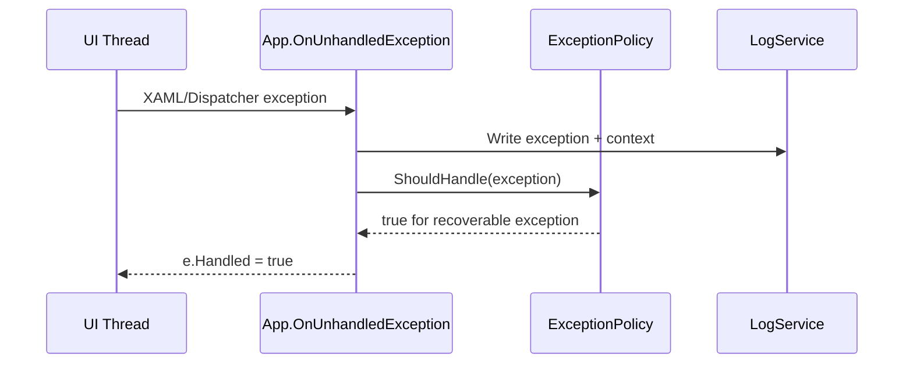
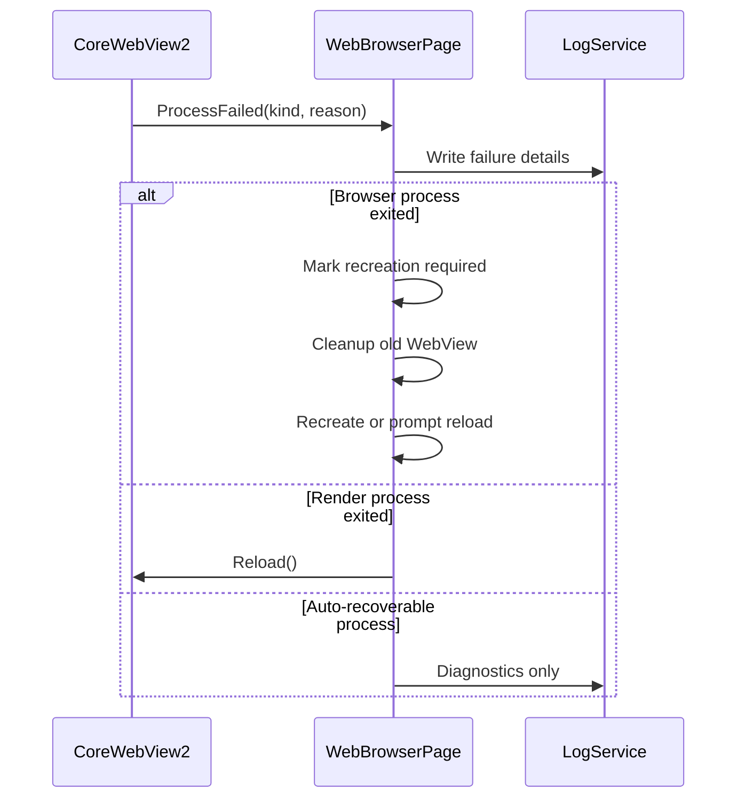
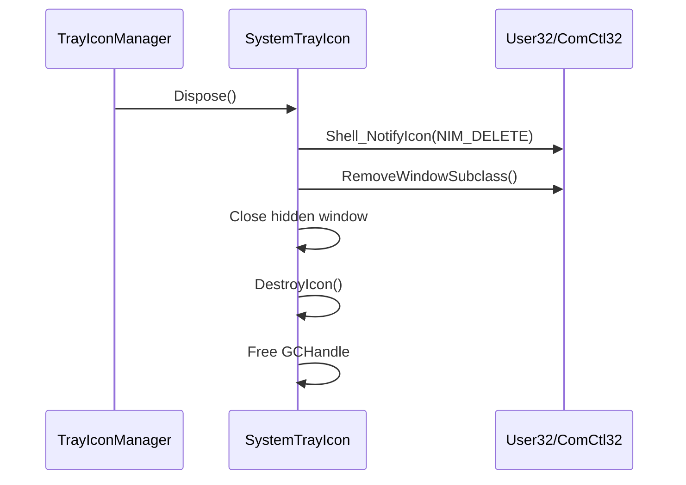

# Quality Stability Fixes Design Document

v0.1 Draft - 静默退出稳定性修复

| 文档状态 | 架构版本 | 适用模块 |
|---------|---------|---------|
| 草稿 Draft | v0.1 | 应用入口 / WebView2 / 托盘 / 窗口生命周期 |

## 1. 概述

本设计文档基于 `bugfix.md` 中的缺陷分析，目标是修复 Docked AI 在长时间空闲后静默退出的问题，并提升崩溃可观测性、组件恢复能力和托盘模式稳定性。

当前 Windows 事件日志显示多次崩溃落在 `Microsoft.UI.Xaml.dll`，异常代码为 `0xc000027b`，并且没有对应的 `.NET Runtime` 托管异常事件。结合代码审查，优先判断为 XAML/WinRT/CoreMessaging 边界上的未处理异常、WebView2 进程失败、原生回调生命周期或隐藏窗口生命周期问题。

本次修复遵循以下原则：

- 先止血：阻止可恢复的 XAML 未处理异常直接终止进程。
- 可观测：所有关键崩溃路径必须有结构化日志。
- 可恢复：WebView2 和 keep-alive 窗口失败时优先重建，不让应用静默消失。
- 小步推进：先修 P0/P1 高风险点，再逐步收敛 async void 和生命周期治理。
- 保持现有技术栈：本次是稳定性修复，不新增 UI 功能，不引入 XAML 之外的新 UI 面。

## 2. 信息来源

- Microsoft Learn: WebView2 process-related events  
  https://learn.microsoft.com/en-us/microsoft-edge/webview2/concepts/process-related-events
- Microsoft Learn: Windows App SDK app lifecycle  
  https://learn.microsoft.com/en-us/windows/apps/windows-app-sdk/applifecycle/applifecycle
- Microsoft Learn: Application.UnhandledException Event  
  https://learn.microsoft.com/en-us/windows/windows-app-sdk/api/winrt/microsoft.ui.xaml.application.unhandledexception

关键依据：

- WebView2 官方文档说明 WebView2 使用多进程模型，进程可能在运行期间退出，应用应处理 `CoreWebView2.ProcessFailed` 和 `CoreWebView2Environment.BrowserProcessExited`。
- Windows App SDK 桌面应用与 UWP 生命周期不同，托盘运行必须确保至少有有效窗口或显式生命周期承载对象存在。
- `Application.UnhandledException` 是 XAML 未处理异常的统一入口，必须记录异常上下文，并对可恢复异常设置 handled，避免进程直接退出。

## 3. 现状问题

### 3.1 XAML 未处理异常只记录不拦截

位置：`功能/应用入口/应用入口.cs`

当前 `OnUnhandledException` 仅调用 `LogService.Error`，未设置 `e.Handled = true`。如果 UI 线程、Dispatcher 回调、XAML 事件或 `async void` continuation 抛出异常，应用仍可能直接崩溃。

### 3.2 async void 异常不可控

多个事件处理器使用 `async void`。事件处理器本身可以保留 `async void` 签名，但内部应委托到 `async Task` 方法，并统一通过安全包装器记录异常。

高风险位置：

- `WindowHostController.OnWindowStateChanged`
- `MainWindow.ShowSplash`
- `WebBrowserPage_Loaded`
- `CoreWebView2_NavigationCompleted`
- `CoreWebView2_WebMessageReceived`
- `AppRestartService.RestartWithArgs`

### 3.3 WebView2 进程失败缺少诊断和恢复

位置：`功能/页面/网页应用/网页浏览/网页浏览页面.xaml.cs`

当前 WebView2 初始化成功后订阅了导航、标题、历史、消息等事件，但没有订阅：

- `CoreWebView2.ProcessFailed`
- `CoreWebView2Environment.BrowserProcessExited`

这会导致浏览器进程、渲染进程、GPU 进程异常时无法记录失败原因，也无法主动重建或重新加载。

### 3.4 keep-alive 窗口缺少自愈

位置：`功能/应用入口/应用入口.cs`

托盘模式依赖 `_keepAliveWindow` 保持应用进程。如果该窗口意外关闭或引用被清空，最后一个窗口关闭后进程可能结束。当前没有对 `_keepAliveWindow.Closed` 做自愈处理。

### 3.5 SystemTrayIcon 原生回调生命周期不完整

位置：`功能/托盘/SystemTrayIcon.cs`

当前实现存在两个风险：

- `GCHandle.Alloc(this, GCHandleType.Weak)` 传给 native subclass，托管对象生命周期不够稳。
- Dispose 时没有调用 `RemoveWindowSubclass`，可能留下悬挂 native 回调。

## 4. 目标架构

本次修复引入四个稳定性支点：

| 支点 | 目标 | 主要文件 |
|------|------|----------|
| 全局异常守护 | 捕获并记录 UI/XAML 异常，阻止可恢复异常终止进程 | `应用入口.cs` |
| 异步安全包装 | 收敛 async void continuation 异常 | 新增或局部 helper |
| WebView2 进程恢复 | 记录 ProcessFailed / BrowserProcessExited 并恢复 | `网页浏览页面.xaml.cs` |
| 原生资源生命周期 | 清理 subclass / hook / keep-alive，避免悬挂回调 | `SystemTrayIcon.cs`, `应用入口.cs` |

## 5. 组件设计

### 5.1 全局异常守护

#### 设计目标

- 捕获 XAML 未处理异常。
- 写入完整日志：异常类型、消息、堆栈、线程、窗口状态、进程运行时间。
- 对可恢复异常设置 `e.Handled = true`。
- 对明显不可恢复异常保留退出行为，避免掩盖严重内存损坏。

#### 设计方案

在 `App.OnUnhandledException` 中调用统一处理方法：

```csharp
private void OnUnhandledException(object sender, UnhandledExceptionEventArgs e)
{
    LogService.Error("App", BuildUnhandledExceptionContext(), e.Exception);

    if (ExceptionPolicy.ShouldHandleXamlException(e.Exception))
    {
        e.Handled = true;
    }
}
```

异常策略建议：

| 异常类型 | 行为 |
|----------|------|
| `NullReferenceException`, `ObjectDisposedException`, `InvalidOperationException`, `COMException` | 记录并 handled |
| `OutOfMemoryException`, `StackOverflowException`, `AccessViolationException` | 记录后不 handled |
| 未知异常 | 初期可 handled，用日志观察一轮后再细分 |

说明：`.NET` 中 `StackOverflowException` 通常无法可靠捕获，此处主要表达策略边界。

#### 诊断上下文

建议记录：

- `Environment.ProcessId`
- `Environment.ProcessPath`
- `Environment.CommandLine`
- `App.MainWindow != null`
- `_keepAliveWindow != null`
- 当前主窗口状态（如果实现 `IWindowToggle`）
- 日志目录路径

### 5.2 异步安全包装

#### 设计目标

避免 `async void` continuation 抛出的异常绕过业务代码，直接进入 XAML 未处理异常。

#### 设计方案

新增轻量 helper，例如：

```csharp
internal static class AsyncSafety
{
    public static async void Run(Func<Task> action, string module, string operation)
    {
        try
        {
            await action();
        }
        catch (Exception ex)
        {
            LogService.Error(module, operation, ex);
        }
    }

    public static async Task RunTask(Func<Task> action, string module, string operation)
    {
        try
        {
            await action();
        }
        catch (Exception ex)
        {
            LogService.Error(module, operation, ex);
        }
    }
}
```

事件处理器保留 WinUI 要求的签名：

```csharp
private void WebBrowserPage_Loaded(object sender, RoutedEventArgs e)
{
    AsyncSafety.Run(WebBrowserPageLoadedAsync, "WebBrowserPage", "Loaded");
}
```

对应逻辑移入：

```csharp
private async Task WebBrowserPageLoadedAsync()
{
    await EnsureWebViewInitializedAsync();
    TryNavigatePendingUri();
}
```

首批只改高风险路径，避免一次性重构过多。

### 5.3 WebView2 进程失败恢复

#### 设计目标

- 初始化成功后订阅 WebView2 进程失败事件。
- 记录失败类型、原因、描述、当前 URL。
- 对主 frame 渲染进程崩溃尝试 `Reload`。
- 对 browser process 退出标记 WebView 需重建。

#### 事件订阅

在 `EnsureWebViewInitializedAsync` 中 CoreWebView2 初始化成功后：

```csharp
WebView.CoreWebView2.ProcessFailed += CoreWebView2_ProcessFailed;
environment.BrowserProcessExited += CoreWebView2Environment_BrowserProcessExited;
```

需要保存当前 environment 引用或至少保存事件订阅状态，确保清理时取消订阅。

#### 恢复策略

| 失败类型 | 恢复方式 |
|----------|----------|
| `BrowserProcessExited` | 标记 `_needsWebViewRecreation = true`，关闭旧 WebView，提示/自动重建 |
| `RenderProcessExited` | 尝试 `CoreWebView2.Reload()` |
| `FrameRenderProcessExited` | 记录日志，必要时提示刷新 |
| `RenderProcessUnresponsive` | 记录计数；连续多次后 Reload |
| `GpuProcessExited`, `UtilityProcessExited` | 记录日志，通常无需恢复 |

#### 防重复恢复

新增字段：

```csharp
private bool _isRecoveringWebView;
private CoreWebView2Environment? _webViewEnvironment;
```

恢复流程使用 guard，避免多个 WebView2 进程事件同时触发造成重建竞争。

### 5.4 keep-alive 窗口自愈

#### 设计目标

确保托盘模式下应用不会因为最后一个窗口关闭而自然退出。

#### 设计方案

在 `EnsureKeepAliveWindow` 创建窗口后订阅：

```csharp
_keepAliveWindow.Closed += OnKeepAliveWindowClosed;
```

处理器：

```csharp
private void OnKeepAliveWindowClosed(object sender, WindowEventArgs args)
{
    LogService.Warning("App", "Keep-alive window closed unexpectedly");
    _keepAliveWindow = null;

    if (_trayIconManager != null && !IsExiting)
    {
        EnsureKeepAliveWindow();
    }
}
```

需要新增 `_isExiting` 标志，避免用户主动退出时自愈窗口重新创建。

### 5.5 SystemTrayIcon 原生生命周期

#### 设计目标

- native subclass 注册和注销成对。
- 托管对象在 native callback 存活期间保持强引用。
- Dispose 幂等，避免重复释放崩溃。

#### 设计方案

修改点：

- `GCHandleType.Weak` 改为 `GCHandleType.Normal`。
- 保存 subclass id 常量。
- Dispose 中按顺序执行：
  1. 取消托盘图标。
  2. 调用 `RemoveWindowSubclass`。
  3. 关闭隐藏窗口。
  4. Destroy icon。
  5. Free GCHandle。

伪代码：

```csharp
if (_hWnd != IntPtr.Zero)
{
    RemoveWindowSubclass(_hWnd, _subclassDelegate, SubclassId);
}

if (_gcHandle.IsAllocated)
{
    _gcHandle.Free();
}
```

### 5.6 日志与诊断

现有 `LogService` 已支持 `error.log` 和 `app.log`。本次扩展不需要替换日志系统，只需统一调用。

建议新增诊断事件：

- `App.XamlUnhandledException`
- `App.KeepAliveWindowClosed`
- `WebView2.ProcessFailed`
- `WebView2.BrowserProcessExited`
- `TrayIcon.NativeCallbackAfterDispose`
- `AsyncSafety.UnhandledAsyncException`

## 6. 数据流

### 6.1 XAML 异常路径



### 6.2 WebView2 恢复路径



### 6.3 托盘原生回调清理路径



## 7. 实施顺序

推荐按以下顺序落地：

1. P0: `Application.UnhandledException` handled + 诊断上下文。
2. P1: WebView2 `ProcessFailed` / `BrowserProcessExited` 诊断与恢复。
3. P1: `SystemTrayIcon` subclass 清理和强引用修复。
4. P2: keep-alive 窗口关闭自愈。
5. P2: 高风险 `async void` 改为安全包装。
6. P3: 增加回归验证脚本和长时间空闲观察清单。

## 8. 风险分析

| 风险 | 影响 | 缓解 |
|------|------|------|
| 过度 `e.Handled = true` 掩盖严重错误 | 严重错误继续运行导致状态污染 | 使用异常策略，记录所有上下文，后续按日志收紧 |
| WebView2 重建和 LRU 缓存冲突 | 页面缓存状态不一致 | 使用 `_isRecoveringWebView` guard，并复用 `DisposeWebView` 现有逻辑 |
| RemoveWindowSubclass 参数不匹配 | subclass 未被移除 | 保存同一个 delegate 和 subclass id 常量 |
| keep-alive 自愈在主动退出时误触发 | 应用无法退出 | 使用 `_isExiting` 标志 |
| async void 重构范围过大 | 引入行为回归 | 第一阶段只改高风险路径 |

## 9. 验证方案

### 9.1 静态验证

- 搜索 `UnhandledException`，确认 XAML 异常会设置 handled。
- 搜索 `ProcessFailed`，确认 WebView2 初始化和清理成对。
- 搜索 `RemoveWindowSubclass`，确认 native subclass 注册和注销成对。
- 搜索高风险 `async void`，确认首批方法已委托到 `async Task`。

### 9.2 运行验证

按项目约定优先使用：

```powershell
dotnet run
```

或：

```powershell
winapp run .\bin\x64\Debug\net10.0-windows10.0.19041.0\win-x64 --debug-output
```

验证场景：

- 正常启动、显示主窗口、隐藏到托盘。
- 右键托盘菜单打开和关闭。
- 打开 WebView 页面，导航、刷新、关闭页面。
- 关闭主窗口后仅托盘运行，再点击托盘恢复。
- 长时间空闲后恢复操作。
- 检查 Windows Application 事件日志是否仍出现 `Docked AI.exe` + `Microsoft.UI.Xaml.dll` + `0xc000027b`。

### 9.3 日志验证

检查应用 LocalFolder 下 `logs/error.log` 和 `logs/app.log`：

- XAML 异常应包含 `App.XamlUnhandledException`。
- WebView2 进程失败应包含 `ProcessFailedKind` 和 `Reason`。
- keep-alive 意外关闭应包含 warning。
- 托盘 Dispose 不应出现 native callback after dispose。

## 10. 非目标

本次设计不处理以下内容：

- 不重构完整窗口状态机。
- 不替换日志系统。
- 不新增用户可见设置页面。
- 不新增 XAML UI 功能。
- 不升级 Windows App SDK 或 WebView2 Runtime 依赖。

## 11. 需求映射

| bugfix.md 需求 | 设计章节 |
|----------------|----------|
| 2.1 Application.UnhandledException 正确处理 | 5.1 |
| 2.2 async void 方法改造 | 5.2 |
| 2.3 WebView2 进程失败恢复 | 5.3 |
| 2.4 Keep-alive 窗口生命周期保护 | 5.4 |
| 2.5 SystemTrayIcon 原生回调管理 | 5.5 |
| 3.1 正常启动和关闭流程 | 7, 9 |
| 3.2 WebView2 正常导航和功能 | 5.3, 9 |
| 3.3 窗口状态管理 | 5.2, 9 |
| 3.4 托盘图标功能 | 5.5, 9 |
| 3.5 全局系统钩子和监听服务 | 8, 9 |
