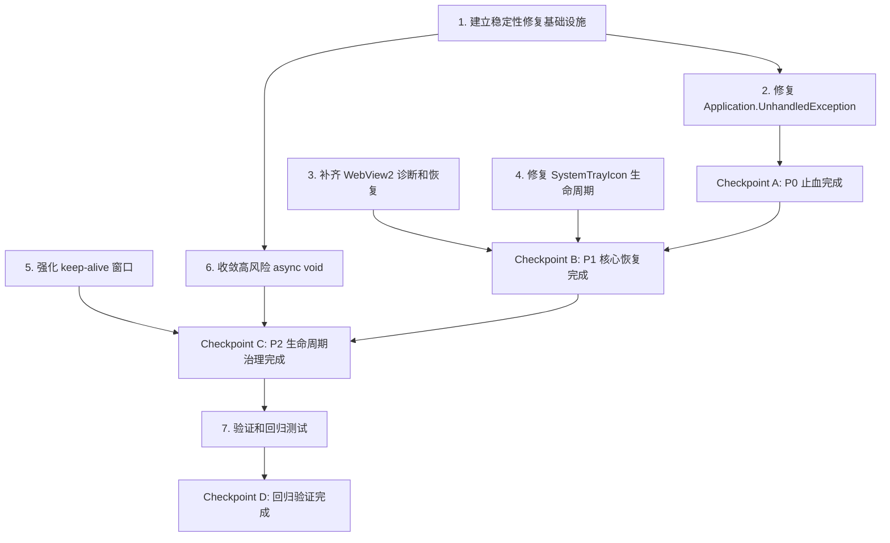

# Implementation Plan: Quality Stability Fixes

## Overview

本任务文档将 `bugfix.md` 和 `design.md` 拆解为可执行的稳定性修复步骤。实施目标是优先阻止静默退出、补齐崩溃诊断、提升 WebView2 和托盘生命周期恢复能力，同时避免大范围重构带来的回归。

执行顺序按风险和收益排序：

1. P0 先处理 XAML 未处理异常，立即降低静默退出概率。
2. P1 补齐 WebView2 和托盘 native 生命周期。
3. P2 强化 keep-alive 和 async void。
4. P3 做长时间空闲验证和日志回归。

## Tasks

- [x] 1. 建立稳定性修复基础设施
  - [x] 1.1 新增异常策略 helper
    - 创建轻量 `ExceptionPolicy` 或等价私有方法，用于判断 XAML 异常是否可 handled
    - 将 `NullReferenceException`、`ObjectDisposedException`、`InvalidOperationException`、`COMException` 归为可恢复候选
    - 将 `OutOfMemoryException` 等严重异常排除在 handled 之外
    - _需求：2.1.1、2.1.2、2.1.3_

  - [x] 1.2 新增异步安全 helper
    - 创建 `AsyncSafety` 或模块内私有包装方法
    - 支持 `Func<Task>` 安全执行
    - 捕获异常后调用 `LogService.Error`
    - 不改变事件处理器对 WinUI 的签名要求
    - _需求：2.2.1、2.2.2、2.2.3_

  - [x] 1.3 扩展诊断上下文记录
    - 在异常日志中加入进程 ID、命令行、主窗口存在状态、keep-alive 窗口存在状态
    - 确保日志写入失败不会影响应用运行
    - _需求：2.1.2_

- [x] 2. 修复 `Application.UnhandledException` 静默退出路径
  - [x] 2.1 更新 `App.OnUnhandledException`
    - 记录完整 XAML 异常上下文
    - 对可恢复异常设置 `e.Handled = true`
    - 保持严重异常不被吞掉
    - _需求：2.1.1、2.1.2、2.1.3_

  - [x] 2.2 增强 AppDomain 和 TaskScheduler 日志
    - `CurrentDomain_UnhandledException` 记录 `IsTerminating`
    - `TaskScheduler_UnobservedTaskException` 保持 `e.SetObserved()`
    - 日志模块名称统一，方便搜索
    - _需求：2.1.2、2.2.2_

  - [x] 2.3 增加一次人工异常验证入口
    - 使用 DEBUG 条件或临时内部方法验证日志路径
    - 验证后不暴露给用户界面
    - _需求：2.1.1_

- [x] 3. 补齐 WebView2 进程失败诊断和恢复
  - [x] 3.1 保存 WebView2 environment 引用
    - 在 `WebBrowserPage` 中增加 `_webViewEnvironment` 字段
    - 避免重复订阅 `BrowserProcessExited`
    - 在清理时取消订阅
    - _需求：2.3.1、2.3.3_

  - [x] 3.2 订阅 `CoreWebView2.ProcessFailed`
    - 在 CoreWebView2 初始化成功后订阅
    - 清理 WebView 时取消订阅
    - 防止重新初始化后重复订阅
    - _需求：2.3.1、3.2.1_

  - [x] 3.3 实现 `CoreWebView2_ProcessFailed`
    - 记录 `ProcessFailedKind`
    - 记录 `Reason`
    - 记录当前 URL、shortcut id、是否正在恢复
    - 捕获 handler 内部异常，避免二次崩溃
    - _需求：2.3.2_

  - [x] 3.4 实现 WebView2 恢复策略
    - `RenderProcessExited` 时优先调用 `Reload`
    - `BrowserProcessExited` 时标记 `_needsWebViewRecreation = true`
    - 主浏览器进程失败时关闭旧 WebView 并允许后续重新创建
    - `RenderProcessUnresponsive` 记录次数，连续多次后 reload
    - _需求：2.3.3、3.2.1、3.2.2、3.2.3_

  - [x] 3.5 增加恢复防重入 guard
    - 新增 `_isRecoveringWebView`
    - 多个进程事件同时触发时只执行一次恢复
    - 恢复结束后正确重置 guard
    - _需求：2.3.3_

- [x] 4. 修复 `SystemTrayIcon` 原生 subclass 生命周期
  - [x] 4.1 改强引用 GCHandle
    - 将 `GCHandleType.Weak` 改为 `GCHandleType.Normal`
    - 确保 native callback 存活期间托管对象不会被提前回收
    - _需求：2.5.1_

  - [x] 4.2 增加 `RemoveWindowSubclass` P/Invoke
    - 定义与 `SetWindowSubclass` 对应的 `RemoveWindowSubclass`
    - 保存 subclass id 常量，避免魔法数字散落
    - _需求：2.5.2_

  - [x] 4.3 调整 Dispose 顺序
    - 先从托盘删除图标
    - 再移除 subclass
    - 再关闭隐藏窗口
    - 再销毁 icon
    - 最后释放 GCHandle
    - 确保 Dispose 可重复调用
    - _需求：2.5.2、2.5.3、3.4.1、3.4.2_

  - [x] 4.4 保护 WndProc 已释放路径
    - 在 `WndProc` 开头检查 `_disposed`
    - 已释放时直接走 `DefSubclassProc`
    - 记录异常但不从 native callback 抛出
    - _需求：2.5.3_

- [x] 5. 强化 keep-alive 窗口生命周期
  - [x] 5.1 增加应用退出状态标志
    - 在 `App` 中新增 `_isExiting`
    - `ExitApplication` 开始时设置为 true
    - 防止主动退出时 keep-alive 自愈重新创建窗口
    - _需求：2.4.2、3.1.2_

  - [x] 5.2 订阅 keep-alive 窗口 Closed 事件
    - `EnsureKeepAliveWindow` 创建窗口后订阅 Closed
    - 正常退出时取消订阅
    - _需求：2.4.1、2.4.3_

  - [x] 5.3 实现 keep-alive 自愈
    - 非退出状态下检测到 keep-alive 窗口关闭时写 warning 日志
    - 如果托盘管理器仍存在，则重新创建 keep-alive 窗口
    - 重建失败时写 error 日志
    - _需求：2.4.2、2.4.3、3.1.3_

  - [x] 5.4 增加主窗口关闭后的 keep-alive 检查
    - 在托盘关闭主窗口路径后检查 keep-alive 是否存在
    - 缺失时调用恢复逻辑
    - _需求：1.4.1、1.4.2、2.4.2_

- [x] 6. 收敛高风险 `async void`
  - [x] 6.1 重构 `WindowHostController.OnWindowStateChanged`
    - 保留事件订阅入口
    - 将主体移动到 `OnWindowStateChangedAsync`
    - 使用 async safety helper 捕获异常
    - 保留现有状态回滚逻辑
    - _需求：2.2.1、2.2.2、3.3.1、3.3.2_

  - [x] 6.2 重构 `MainWindow.ShowSplash`
    - 将主体移动到 `ShowSplashAsync`
    - 入口使用安全包装
    - 访问 UI 元素前检查窗口是否关闭或内容是否仍可用
    - _需求：2.2.1、2.2.3、3.1.1_

  - [x] 6.3 重构 WebView2 页面高风险事件
    - `WebBrowserPage_Loaded` 委托到 `WebBrowserPageLoadedAsync`
    - `CoreWebView2_NavigationCompleted` 委托到 `CoreWebView2NavigationCompletedAsync`
    - `CoreWebView2_WebMessageReceived` 委托到 `CoreWebView2WebMessageReceivedAsync`
    - _需求：2.2.1、2.2.2、2.2.3、3.2.2、3.2.3_

  - [x] 6.4 审查 `DispatcherQueue.TryEnqueue(async () => ...)`
    - 将 async lambda 改为安全包装调用
    - 确认异常不会直接进入 XAML 未处理异常路径
    - _需求：2.2.2、3.5.3_

- [x] 7. 验证和回归测试
  - [x] 7.1 静态搜索验证
    - 搜索 `UnhandledException`，确认 handled 策略已接入
    - 搜索 `ProcessFailed`，确认订阅和取消订阅成对
    - 搜索 `RemoveWindowSubclass`，确认 subclass 清理存在
    - 搜索高风险 `async void`，确认首批路径已包装
    - _需求：全部_

  - [x] 7.2 运行应用验证
    - 使用 `dotnet run` 启动应用
    - 如果需要调试输出，使用 `winapp run .\bin\x64\Debug\net10.0-windows10.0.19041.0\win-x64 --debug-output`
    - 验证启动、托盘、主窗口显示隐藏、WebView 页面加载
    - _需求：3.1.1、3.1.2、3.1.3、3.2.1_

  - [ ] 7.3 托盘回归验证
    - 左键点击托盘图标切换窗口
    - 右键点击托盘图标显示菜单
    - 关闭主窗口后确认进程仍在托盘运行
    - 主动退出时确认进程正常退出且没有 keep-alive 重建
    - _需求：3.4.1、3.4.2、3.4.3_

  - [ ] 7.4 WebView2 回归验证
    - 打开网页应用页面
    - 导航、刷新、返回、前进
    - 关闭或驱逐 WebView 页面
    - 检查日志没有重复订阅或对象已释放异常
    - _需求：3.2.1、3.2.2、3.2.3_

  - [ ] 7.5 Windows 事件日志验证
    - 查询最近 Application Error
    - 确认不再出现新的 `Docked AI.exe` + `Microsoft.UI.Xaml.dll` + `0xc000027b`
    - 如仍出现，记录 Report ID 和 faulting module
    - _需求：2.1.1、2.1.2_

  - [ ] 7.6 长时间空闲观察
    - 应用隐藏到托盘后空闲至少 2 小时
    - 恢复后点击托盘图标和 WebView 页面
    - 检查 `logs/error.log` 和 Windows 事件日志
    - _需求：1.1.1、1.2.3、2.4.3_

## 检查点

- [x] Checkpoint A: P0 止血完成
  - `Application.UnhandledException` 可记录并 handled 可恢复异常
  - 应用不会因普通 XAML 异常直接静默退出

- [x] Checkpoint B: P1 核心恢复完成
  - WebView2 进程失败可记录并恢复
  - SystemTrayIcon subclass 生命周期成对清理

- [x] Checkpoint C: P2 生命周期治理完成
  - keep-alive 窗口具备自愈能力
  - 高风险 async void 已包装

- [ ] Checkpoint D: 回归验证完成
  - 启动、托盘、WebView、退出路径均正常
  - Windows 事件日志未新增同类崩溃

## Task Dependency Graph

```json
{
  "waves": [
    {
      "name": "Wave 1: 基础设施建立",
      "tasks": ["1"]
    },
    {
      "name": "Wave 2: P0 止血修复",
      "tasks": ["2"],
      "dependsOn": ["1"]
    },
    {
      "name": "Wave 3: P1 核心恢复",
      "tasks": ["3", "4"],
      "dependsOn": ["2"]
    },
    {
      "name": "Wave 4: P2 生命周期治理",
      "tasks": ["5", "6"],
      "dependsOn": ["1", "3", "4"]
    },
    {
      "name": "Wave 5: 验证和回归",
      "tasks": ["7"],
      "dependsOn": ["2", "3", "4", "5", "6"]
    }
  ]
}
```



**依赖关系说明：**

- **任务 1** 是基础设施，为任务 2 和任务 6 提供异常处理和异步安全工具
- **任务 2** (P0) 必须首先完成，达到 Checkpoint A 止血效果
- **任务 3** 和 **任务 4** (P1) 可并行执行，完成后达到 Checkpoint B
- **任务 5** 和 **任务 6** (P2) 依赖于任务 1 的基础设施，完成后达到 Checkpoint C
- **任务 7** (P3) 需要所有功能完成后进行全面回归验证

**执行优先级：**
```
P0: Task 1 → Task 2 → Checkpoint A
P1: Task 3 || Task 4 → Checkpoint B
P2: Task 5 || Task 6 → Checkpoint C
P3: Task 7 → Checkpoint D
```

## Notes

- 本任务集只覆盖稳定性修复，不做 UI 重设计。
- 新增 UI 功能必须遵守项目约定使用 Reactor；本次仅修改现有 WinUI/XAML 代码路径。
- 如运行验证需要节省时间，优先使用 `dotnet run` 或已批准的 `winapp run ... --debug-output`。
